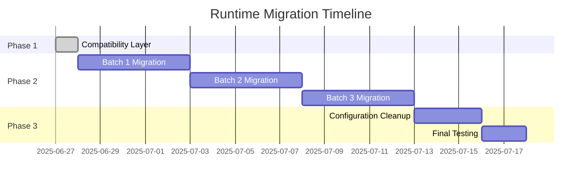

# Deno to Node.js Dependency Mapping Analysis

**Phase 2 Runtime Migration - Issues #72, #79**

## Executive Summary

- **Total Deno API Usage**: 507 instances across codebase
- **Critical Migration Targets**: 10 high-usage files
- **External Dependencies**: 4 Deno-specific packages need Node.js equivalents
- **Migration Strategy**: Progressive batch migration with rollback capability

## Deno API Usage Statistics

| API | Usage Count | Node.js Equivalent | Migration Priority |
|-----|-------------|-------------------|--------------------|
| `Deno.writeTextFile` | 130 | `fs.promises.writeFile` | HIGH |
| `Deno.readTextFile` | 49 | `fs.promises.readFile` | HIGH |
| `Deno.stat` | 46 | `fs.promises.stat` | HIGH |
| `Deno.mkdir` | 42 | `fs.promises.mkdir` | HIGH |
| `Deno.env` | 34 | `process.env` | HIGH |
| `Deno.exit` | 31 | `process.exit` | MEDIUM |
| `Deno.remove` | 30 | `fs.promises.rm` | HIGH |
| `Deno.Command` | 30 | `child_process.spawn` | HIGH |
| `Deno.cwd` | 23 | `process.cwd` | MEDIUM |
| `Deno.readDir` | 12 | `fs.promises.readdir` | MEDIUM |
| `Deno.args` | 12 | `process.argv.slice(2)` | MEDIUM |
| `Deno.stdin` | 10 | `process.stdin` | LOW |
| `Deno.errors` | 9 | Custom error classes | MEDIUM |
| `Deno.addSignalListener` | 9 | `process.on` | MEDIUM |
| `Deno.memoryUsage` | 8 | `process.memoryUsage` | LOW |
| `Deno.build` | 8 | `process.platform/arch` | LOW |
| `Deno.stdout` | 7 | `process.stdout` | LOW |
| `Deno.pid` | 5 | `process.pid` | LOW |
| `Deno.kill` | 4 | `process.kill` | LOW |
| `Deno.chdir` | 4 | `process.chdir` | LOW |

## External Dependencies Migration

### Deno External Imports → Node.js NPM Packages

```json
{
  "@std/path": "path (built-in)",
  "@std/fs": "fs/promises (built-in)",
  "@std/io": "readline (built-in)",
  "@cliffy/command": "commander",
  "@cliffy/ansi/colors": "chalk",
  "@cliffy/prompt": "inquirer",
  "@cliffy/table": "cli-table3"
}
```

### Already Available in package.json
✅ `commander` (v11.1.0) - replaces @cliffy/command  
✅ `chalk` (v5.3.0) - replaces @cliffy/ansi/colors  
✅ `inquirer` (v9.2.12) - replaces @cliffy/prompt  
✅ `cli-table3` (v0.6.3) - replaces @cliffy/table  

## High-Usage Files Requiring Migration

| File | Deno API Count | Migration Complexity | Batch Group |
|------|---------------|---------------------|-------------|
| `src/cli/simple-commands/init/index.js` | 28 | HIGH | Batch 1 |
| `src/cli/simple-commands/init/rollback/backup-manager.js` | 27 | HIGH | Batch 1 |
| `src/swarm/coordinator.ts` | 26 | CRITICAL | Batch 1 |
| `src/cli/commands/swarm.ts` | 23 | HIGH | Batch 2 |
| `src/cli/simple-commands/init/rollback/rollback-executor.js` | 22 | HIGH | Batch 1 |
| `src/cli/commands/swarm-new.ts` | 21 | HIGH | Batch 2 |
| `src/cli/commands/start/start-command.ts` | 21 | HIGH | Batch 2 |
| `src/cli/simple-commands/init/rollback/recovery-manager.js` | 19 | MEDIUM | Batch 3 |
| `src/cli/simple-commands/swarm.js` | 18 | MEDIUM | Batch 3 |
| `src/cli/simple-commands/swarm-executor.js` | 17 | MEDIUM | Batch 3 |

## Migration Strategy

### Phase 1: Compatibility Layer (COMPLETED)
✅ Created `deno-compatibility-layer.ts` with complete API mapping

### Phase 2: Batch Migration

**Batch 1: Critical Core Files (Week 1)**
- `src/swarm/coordinator.ts` - Core swarm coordination
- `src/cli/simple-commands/init/index.js` - Initialization system
- `src/cli/simple-commands/init/rollback/backup-manager.js` - Backup management
- `src/cli/simple-commands/init/rollback/rollback-executor.js` - Rollback functionality

**Batch 2: Command Layer (Week 2)**
- `src/cli/commands/swarm.ts` - Main swarm commands
- `src/cli/commands/swarm-new.ts` - New swarm creation
- `src/cli/commands/start/start-command.ts` - Start command

**Batch 3: Supporting Files (Week 3)**
- `src/cli/simple-commands/init/rollback/recovery-manager.js`
- `src/cli/simple-commands/swarm.js`
- `src/cli/simple-commands/swarm-executor.js`
- All remaining files with Deno API usage

### Phase 3: Configuration Migration

**Remove Deno Configuration:**
- `deno.json` → Archive
- `deno.lock` → Remove
- Deno-specific scripts in `package.json`

**Update Build Process:**
- Remove `build:deno` script
- Update CI/CD to use Node.js only
- Consolidate test framework to Jest

## Risk Mitigation

### Rollback Strategy
1. **Git Branching**: Each batch migration in separate feature branch
2. **Compatibility Testing**: Run both runtimes in parallel during transition
3. **Performance Monitoring**: Track memory usage, execution time
4. **Automated Testing**: Full test suite validation after each batch

### Quality Assurance
- **Functionality Parity**: All features must work identically
- **Performance Benchmarks**: No degradation > 5%
- **Error Handling**: Maintain same error behavior
- **CLI Compatibility**: All commands work identically

## Migration Timeline



## Success Metrics

- ✅ **Zero Deno API Usage**: All `Deno.` references removed
- ✅ **Single Runtime**: Only Node.js required to run
- ✅ **Performance Parity**: < 5% performance difference
- ✅ **Test Coverage**: All tests passing in Node.js
- ✅ **CLI Compatibility**: All commands work identically
- ✅ **Build Simplification**: Single build process

## Next Steps

1. **Wait for Runtime Analyzer**: Monitor Memory for dependency analysis completion
2. **Begin Batch 1**: Start with critical core files
3. **Progressive Testing**: Validate each batch before proceeding
4. **Performance Monitoring**: Track metrics throughout migration
5. **Documentation Update**: Update all runtime references