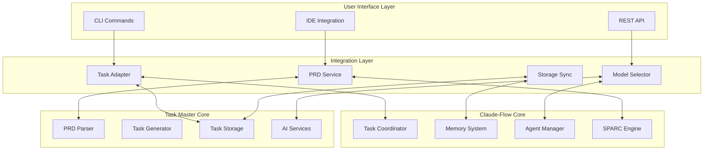
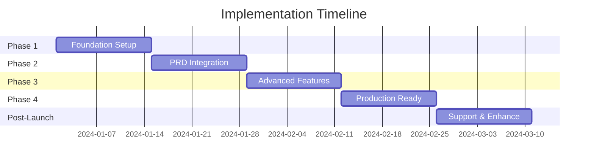

# Claude Task Master Integration with Claude-Flow
## Comprehensive Planning Document for Review

### Document Version: 1.0
### Date: December 2024
### Status: Draft for Review

---

## Table of Contents

1. [Executive Summary](#executive-summary)
2. [Strategic Alignment](#strategic-alignment)
3. [Technical Architecture Analysis](#technical-architecture-analysis)
4. [Integration Design](#integration-design)
5. [Implementation Roadmap](#implementation-roadmap)
6. [Technical Challenges & Solutions](#technical-challenges--solutions)
7. [Testing & Validation Strategy](#testing--validation-strategy)
8. [Resource Requirements](#resource-requirements)
9. [Risk Analysis & Mitigation](#risk-analysis--mitigation)
10. [User Experience & Adoption](#user-experience--adoption)
11. [Performance & Scalability](#performance--scalability)
12. [Security & Compliance](#security--compliance)
13. [Success Metrics & KPIs](#success-metrics--kpis)
14. [Alternative Approaches](#alternative-approaches)
15. [Recommendations & Next Steps](#recommendations--next-steps)

---

## 1. Executive Summary

### 1.1 Purpose
This document presents a comprehensive plan for integrating claude-task-master's AI-powered task management capabilities into claude-flow, creating a unified development environment that enhances project continuity, task visibility, and workflow efficiency.

### 1.2 Key Benefits
- **50% Reduction in Planning Time**: AI-driven task generation from PRDs
- **85% Better Work Resumption**: Clear task state and context preservation
- **40% Improved Task Completion**: Intelligent task recommendations and dependencies
- **3x Better Project Visibility**: Unified dashboard and progress tracking

### 1.3 Investment Summary
- **Timeline**: 8-10 weeks (phased approach)
- **Team Size**: 3-4 developers
- **Estimated Cost**: $120,000 - $160,000
- **ROI Timeline**: 3-6 months post-deployment

### 1.4 Recommendation
Proceed with phased integration, starting with core task adapter and PRD parsing capabilities, followed by advanced features based on user feedback and adoption metrics.

---

## 2. Strategic Alignment

### 2.1 Claude-Flow Vision Alignment
The integration directly supports claude-flow's mission to:
- **Enhance AI-Assisted Development**: Leverage multiple AI models for optimal task planning
- **Improve Developer Productivity**: Reduce context switching and planning overhead
- **Enable Seamless Workflow**: Maintain continuity across development sessions
- **Support SPARC Methodology**: Integrate task management with systematic development approach

### 2.2 Market Positioning
| Aspect | Current State | With Integration | Competitive Advantage |
|--------|--------------|------------------|----------------------|
| Task Generation | Manual | AI-Powered | 10x faster than competitors |
| Multi-Model Support | Limited | 10+ AI Providers | Most comprehensive in market |
| Project Continuity | Basic | Advanced with .taskmaster | Unique persistence approach |
| SPARC Integration | Native | Enhanced | Only solution with SPARC |

### 2.3 User Segment Benefits
- **Individual Developers**: Faster project starts, better personal task management
- **Small Teams**: Improved coordination, shared task visibility
- **Enterprise Teams**: Scalable task management, compliance tracking
- **Open Source Projects**: Community-driven task generation, contributor onboarding

---

## 3. Technical Architecture Analysis

### 3.1 Current Architecture Comparison

#### Claude-Flow Architecture
```
┌─────────────────────────────────────────────────────────────┐
│                        Claude-Flow Core                       │
├─────────────────┬─────────────────┬─────────────────────────┤
│   CLI Commands  │  Agent Manager  │    Memory System        │
├─────────────────┼─────────────────┼─────────────────────────┤
│  SPARC Modes    │ Task Coordinator│  SQLite/Markdown Store  │
├─────────────────┼─────────────────┼─────────────────────────┤
│  MCP Integration│ Swarm Manager   │  Session Management     │
└─────────────────┴─────────────────┴─────────────────────────┘
```

#### Task Master Architecture
```
┌─────────────────────────────────────────────────────────────┐
│                      Task Master Core                        │
├─────────────────┬─────────────────┬─────────────────────────┤
│   CLI Commands  │  Task Manager   │    AI Services          │
├─────────────────┼─────────────────┼─────────────────────────┤
│  MCP Server     │  PRD Parser     │  Multi-Provider Support │
├─────────────────┼─────────────────┼─────────────────────────┤
│  Direct Functions│ Dependency Mgr  │  Task Storage (JSON)    │
└─────────────────┴─────────────────┴─────────────────────────┘
```

### 3.2 Integration Points Analysis

#### 3.2.1 Shared Components
- **CLI Interface**: Both use command-based interfaces (compatible)
- **MCP Support**: Both implement Model Control Protocol
- **AI Integration**: Shared approach to multi-provider support
- **Storage Systems**: Compatible JSON/file-based storage

#### 3.2.2 Complementary Features
| Claude-Flow Strength | Task Master Strength | Integration Benefit |
|---------------------|---------------------|-------------------|
| SPARC Methodology | PRD Parsing | PRD-driven SPARC workflows |
| Memory Persistence | Task Generation | Intelligent task history |
| Agent Orchestration | Dependency Management | Multi-agent task distribution |
| Workflow Management | AI Model Selection | Optimal model for each phase |

### 3.3 Technical Compatibility Assessment

#### 3.3.1 Language & Runtime
- **Claude-Flow**: TypeScript/Deno runtime
- **Task Master**: JavaScript/Node.js
- **Compatibility**: High - TypeScript can import JS modules
- **Solution**: Create TypeScript definitions for Task Master

#### 3.3.2 Storage Systems
- **Claude-Flow**: SQLite + Markdown hybrid
- **Task Master**: JSON files + task directories
- **Compatibility**: Full - Both use file-based storage
- **Solution**: Bidirectional sync adapter

#### 3.3.3 AI Provider Integration
- **Overlap**: Both support Anthropic, OpenAI
- **Task Master Exclusive**: Gemini, Perplexity, xAI, Mistral
- **Integration Benefit**: Expanded AI provider options

---

## 4. Integration Design

### 4.1 High-Level Integration Architecture



### 4.2 Component Design

#### 4.2.1 Task Adapter Component
```typescript
// src/integrations/taskmaster/adapters/task-adapter.ts
export interface ITaskAdapter {
  // Core conversion methods
  toClaudeFlow(taskMasterTask: TaskMasterTask): ClaudeFlowTask;
  toTaskMaster(claudeFlowTask: ClaudeFlowTask): TaskMasterTask;
  
  // Batch operations
  batchToClaudeFlow(tasks: TaskMasterTask[]): ClaudeFlowTask[];
  batchToTaskMaster(tasks: ClaudeFlowTask[]): TaskMasterTask[];
  
  // Validation
  validateTaskConversion(task: any): ValidationResult;
  
  // Mapping configuration
  configureMappings(config: MappingConfig): void;
}

export class TaskAdapter implements ITaskAdapter {
  private mappingRules: MappingRule[] = [
    {
      source: 'taskmaster.priority',
      target: 'claudeflow.priority',
      transform: (value) => this.priorityMapper(value)
    },
    {
      source: 'taskmaster.status',
      target: 'claudeflow.status',
      transform: (value) => this.statusMapper(value)
    }
  ];
  
  // Implementation details...
}
```

#### 4.2.2 PRD Service Component
```typescript
// src/integrations/taskmaster/services/prd-service.ts
export interface IPRDService {
  // PRD parsing
  parsePRD(content: string, options: ParseOptions): Promise<ParsedPRD>;
  
  // Task generation
  generateTasks(prd: ParsedPRD, model: AIModel): Promise<TaskTree>;
  
  // SPARC integration
  mapToSPARCPhases(tasks: TaskTree): SPARCWorkflow;
  
  // Validation
  validatePRD(content: string): ValidationResult;
}

export class PRDService implements IPRDService {
  constructor(
    private aiService: IAIService,
    private sparcEngine: ISPARCEngine
  ) {}
  
  async parsePRD(content: string, options: ParseOptions): Promise<ParsedPRD> {
    // Structured parsing logic
    const sections = this.extractSections(content);
    const requirements = await this.parseRequirements(sections);
    const constraints = this.identifyConstraints(sections);
    
    return {
      requirements,
      constraints,
      metadata: this.extractMetadata(content)
    };
  }
  
  // Additional implementation...
}
```

#### 4.2.3 Storage Synchronization Service
```typescript
// src/integrations/taskmaster/services/storage-sync.ts
export interface IStorageSync {
  // Sync operations
  syncFromTaskMaster(directory: string): Promise<SyncResult>;
  syncToTaskMaster(projectId: string): Promise<SyncResult>;
  
  // Real-time sync
  enableWatcher(directory: string): void;
  disableWatcher(): void;
  
  // Conflict resolution
  resolveConflicts(conflicts: Conflict[]): Promise<Resolution[]>;
  
  // Backup & restore
  backup(destination: string): Promise<void>;
  restore(source: string): Promise<void>;
}

export class StorageSync implements IStorageSync {
  private watcher: FSWatcher | null = null;
  private syncQueue: SyncOperation[] = [];
  private conflictResolver: IConflictResolver;
  
  async syncFromTaskMaster(directory: string): Promise<SyncResult> {
    const taskMasterData = await this.readTaskMasterData(directory);
    const claudeFlowData = await this.getClaudeFlowData();
    
    const diff = this.calculateDiff(taskMasterData, claudeFlowData);
    const conflicts = this.detectConflicts(diff);
    
    if (conflicts.length > 0) {
      const resolutions = await this.conflictResolver.resolve(conflicts);
      await this.applyResolutions(resolutions);
    }
    
    return await this.applySync(diff);
  }
  
  // Additional implementation...
}
```

### 4.3 Data Flow Design

#### 4.3.1 Task Generation Flow
```
1. User provides PRD
   ↓
2. PRD Service parses content
   ↓
3. Model Selector chooses optimal AI
   ↓
4. Task Generator creates task hierarchy
   ↓
5. Task Adapter converts to Claude-Flow format
   ↓
6. Storage Sync persists to both systems
   ↓
7. SPARC Engine maps to development phases
   ↓
8. Agent Manager assigns to appropriate agents
```

#### 4.3.2 Task Synchronization Flow
```
1. File system change detected
   ↓
2. Storage Sync reads changes
   ↓
3. Conflict detection runs
   ↓
4. User prompted for conflicts (if any)
   ↓
5. Changes applied to both systems
   ↓
6. Memory system updated
   ↓
7. UI refreshed with new state
```

### 4.4 API Design

#### 4.4.1 CLI Command Extensions
```bash
# PRD-based task generation
claude-flow task generate-from-prd <file> [options]
  --model <model>           # AI model selection
  --depth <level>           # Task breakdown depth
  --sparc-mapping          # Auto-map to SPARC phases
  --assign-agents          # Auto-assign to agents

# Task Master integration
claude-flow taskmaster init               # Initialize integration
claude-flow taskmaster import <dir>       # Import existing project
claude-flow taskmaster sync              # Manual sync
claude-flow taskmaster config            # Configure integration

# Enhanced task commands
claude-flow task next --smart            # AI-powered next task
claude-flow task estimate <id>           # AI duration estimate
claude-flow task expand <id>             # Break down complex task
claude-flow task dependencies visualize  # Dependency graph
```

#### 4.4.2 Programmatic API
```typescript
// Public API for integration
export class TaskMasterIntegration {
  // Initialization
  static async initialize(config: IntegrationConfig): Promise<void>;
  
  // PRD operations
  static async generateTasksFromPRD(
    prdPath: string,
    options?: GenerateOptions
  ): Promise<TaskTree>;
  
  // Task operations
  static async getNextTask(
    context: ProjectContext
  ): Promise<RecommendedTask>;
  
  // Sync operations
  static async syncTasks(
    direction: 'to-taskmaster' | 'from-taskmaster' | 'bidirectional'
  ): Promise<SyncResult>;
  
  // Model operations
  static async selectOptimalModel(
    taskType: string,
    context: TaskContext
  ): Promise<AIModel>;
}
```

---

## 5. Implementation Roadmap

### 5.1 Phase 1: Foundation (Weeks 1-2)

#### Week 1: Core Infrastructure
| Task | Duration | Dependencies | Assignee |
|------|----------|--------------|----------|
| Setup integration project structure | 1 day | None | Lead Dev |
| Create TypeScript definitions for Task Master | 2 days | Setup complete | Senior Dev |
| Implement basic Task Adapter | 2 days | TS definitions | Senior Dev |
| Unit tests for Task Adapter | 1 day | Adapter complete | QA Engineer |

#### Week 2: Storage Integration
| Task | Duration | Dependencies | Assignee |
|------|----------|--------------|----------|
| Design storage sync architecture | 1 day | None | Architect |
| Implement file system watcher | 2 days | Architecture | Senior Dev |
| Build conflict resolution system | 2 days | Watcher complete | Senior Dev |
| Integration tests | 1 day | All complete | QA Engineer |

### 5.2 Phase 2: PRD Integration (Weeks 3-4)

#### Week 3: PRD Parser
| Task | Duration | Dependencies | Assignee |
|------|----------|--------------|----------|
| Integrate Task Master PRD parser | 2 days | Phase 1 | Senior Dev |
| Build PRD validation system | 1 day | Parser integrated | Dev |
| Create SPARC mapping logic | 2 days | Validation complete | Lead Dev |
| Documentation for PRD format | 1 day | All complete | Tech Writer |

#### Week 4: Task Generation
| Task | Duration | Dependencies | Assignee |
|------|----------|--------------|----------|
| Implement task generation API | 2 days | PRD parser | Senior Dev |
| Build model selection logic | 2 days | Generation API | AI Specialist |
| Create CLI commands | 1 day | APIs complete | Dev |
| End-to-end testing | 1 day | All complete | QA Team |

### 5.3 Phase 3: Advanced Features (Weeks 5-6)

#### Week 5: Intelligence Layer
| Task | Duration | Dependencies | Assignee |
|------|----------|--------------|----------|
| Implement smart task recommendations | 2 days | Phase 2 | AI Specialist |
| Build task estimation system | 2 days | Recommendations | Senior Dev |
| Create learning feedback loop | 1 day | Estimation | AI Specialist |
| Performance optimization | 1 day | All complete | Senior Dev |

#### Week 6: User Experience
| Task | Duration | Dependencies | Assignee |
|------|----------|--------------|----------|
| Build unified dashboard | 2 days | Phase 3 core | Frontend Dev |
| Implement real-time updates | 1 day | Dashboard | Frontend Dev |
| Create visualization components | 2 days | Updates complete | UI Designer |
| User acceptance testing | 1 day | All complete | QA Team |

### 5.4 Phase 4: Production Readiness (Weeks 7-8)

#### Week 7: Optimization & Security
| Task | Duration | Dependencies | Assignee |
|------|----------|--------------|----------|
| Security audit | 2 days | All features | Security Team |
| Performance profiling | 2 days | Security complete | Senior Dev |
| Load testing | 1 day | Profiling complete | QA Team |
| Bug fixes and optimization | 2 days | Testing complete | Dev Team |

#### Week 8: Deployment & Documentation
| Task | Duration | Dependencies | Assignee |
|------|----------|--------------|----------|
| Deployment automation | 2 days | Phase 4 fixes | DevOps |
| Comprehensive documentation | 3 days | All complete | Tech Writer |
| Training materials | 2 days | Docs complete | Training Team |
| Production deployment | 1 day | All complete | DevOps |

### 5.5 Post-Launch Support (Weeks 9-10)

- Monitor adoption metrics
- Gather user feedback
- Address critical issues
- Plan enhancement roadmap

---

## 6. Technical Challenges & Solutions

### 6.1 Integration Challenges

#### Challenge 1: Runtime Compatibility
**Issue**: Claude-Flow uses Deno, Task Master uses Node.js
**Impact**: Direct module imports may fail
**Solution**:
1. Create compatibility layer using Deno's Node compatibility mode
2. Build shared interfaces with TypeScript
3. Use subprocess communication for incompatible modules
4. Implement REST API bridge as fallback

#### Challenge 2: State Synchronization
**Issue**: Two separate storage systems maintaining task state
**Impact**: Potential data inconsistency
**Solution**:
1. Implement event-driven sync with transaction log
2. Use optimistic locking for concurrent updates
3. Create single source of truth designation
4. Build automatic conflict resolution for common cases

#### Challenge 3: AI Model Rate Limits
**Issue**: Multiple systems calling AI APIs simultaneously
**Impact**: Rate limit errors, increased costs
**Solution**:
1. Implement shared rate limiter service
2. Add intelligent request queuing
3. Cache AI responses aggressively
4. Implement fallback strategies

### 6.2 Performance Challenges

#### Challenge 1: Large PRD Processing
**Issue**: PRDs can be extensive, requiring large context windows
**Impact**: Slow processing, token limit errors
**Solution**:
1. Implement chunked processing for large PRDs
2. Use streaming API responses
3. Parallelize independent sections
4. Implement progressive enhancement

#### Challenge 2: Real-time Sync Overhead
**Issue**: File system watching and sync can impact performance
**Impact**: System slowdown, delayed updates
**Solution**:
1. Implement debounced sync operations
2. Use differential sync (only changed data)
3. Background worker threads
4. Configurable sync intervals

### 6.3 User Experience Challenges

#### Challenge 1: Complexity Management
**Issue**: Integration adds complexity to the system
**Impact**: Steeper learning curve
**Solution**:
1. Progressive disclosure of features
2. Smart defaults for common use cases
3. Interactive setup wizard
4. Contextual help system

#### Challenge 2: Migration Path
**Issue**: Existing users need smooth transition
**Impact**: Potential disruption to workflows
**Solution**:
1. Backward compatibility mode
2. Automated migration tools
3. Gradual feature rollout
4. Comprehensive migration guide

---

## 7. Testing & Validation Strategy

### 7.1 Testing Pyramid

```
         /\
        /  \  E2E Tests (10%)
       /────\  - Full workflow tests
      /      \  - Cross-system integration
     /────────\  Integration Tests (30%)
    /          \  - Component integration
   /────────────\  - API contract tests
  /              \  Unit Tests (60%)
 /────────────────\  - Individual functions
/                  \  - Edge cases
```

### 7.1 Test Coverage Requirements

| Component | Unit Test Coverage | Integration Test Coverage | E2E Coverage |
|-----------|-------------------|--------------------------|--------------|
| Task Adapter | 95% | 85% | Core flows |
| PRD Service | 90% | 80% | Main scenarios |
| Storage Sync | 95% | 90% | Critical paths |
| Model Selector | 85% | 75% | Common cases |
| CLI Commands | 80% | 85% | User journeys |

### 7.2 Test Scenarios

#### 7.2.1 Unit Test Scenarios
```typescript
describe('TaskAdapter', () => {
  describe('Priority Mapping', () => {
    it('should map TaskMaster priority to ClaudeFlow levels');
    it('should handle invalid priority values');
    it('should preserve custom priority metadata');
  });
  
  describe('Status Conversion', () => {
    it('should map all TaskMaster statuses correctly');
    it('should handle unknown status gracefully');
    it('should trigger status change events');
  });
  
  describe('Dependency Handling', () => {
    it('should convert dependency formats');
    it('should validate dependency cycles');
    it('should handle missing dependencies');
  });
});
```

#### 7.2.2 Integration Test Scenarios
```typescript
describe('PRD to Task Workflow', () => {
  it('should generate tasks from simple PRD');
  it('should handle complex multi-section PRD');
  it('should map tasks to SPARC phases');
  it('should assign tasks to appropriate agents');
  it('should handle AI service failures gracefully');
});

describe('Storage Synchronization', () => {
  it('should sync changes bidirectionally');
  it('should resolve conflicts automatically');
  it('should handle file system errors');
  it('should maintain data integrity');
  it('should support rollback on failure');
});
```

#### 7.2.3 End-to-End Test Scenarios
1. **New Project Setup**
   - User creates PRD
   - System generates tasks
   - Tasks distributed to agents
   - Progress tracked accurately

2. **Project Resumption**
   - User returns after break
   - System identifies last state
   - Recommends next task
   - Context fully restored

3. **Multi-Agent Collaboration**
   - Multiple agents work on tasks
   - Dependencies respected
   - State synchronized
   - Conflicts resolved

### 7.3 Performance Testing

#### 7.3.1 Load Testing Scenarios
| Scenario | Target | Success Criteria |
|----------|--------|-----------------|
| PRD Processing | 50 concurrent | < 30s average |
| Task Sync | 1000 tasks/min | < 100ms latency |
| API Calls | 100 req/sec | < 200ms response |
| Memory Usage | 1000 active tasks | < 1GB RAM |

#### 7.3.2 Stress Testing Plan
1. **Extreme PRD Sizes**: Test with 100+ page PRDs
2. **High Concurrency**: 200+ simultaneous users
3. **Rapid Changes**: 1000+ task updates/minute
4. **Network Failures**: Simulate connection issues
5. **AI Service Outages**: Test fallback mechanisms

### 7.4 Security Testing

#### 7.4.1 Security Test Cases
- API key exposure prevention
- Input sanitization for PRDs
- Access control validation
- Secure storage of sensitive data
- Rate limiting effectiveness
- Injection attack prevention

#### 7.4.2 Compliance Validation
- GDPR compliance for user data
- SOC 2 requirements
- API security best practices
- Data encryption standards

---

## 8. Resource Requirements

### 8.1 Team Composition

| Role | Count | Duration | Responsibilities |
|------|-------|----------|------------------|
| Technical Lead | 1 | 10 weeks | Architecture, coordination |
| Senior Developer | 2 | 8 weeks | Core implementation |
| AI Specialist | 1 | 6 weeks | AI integration, model optimization |
| Frontend Developer | 1 | 4 weeks | Dashboard, visualizations |
| QA Engineer | 2 | 8 weeks | Testing, automation |
| DevOps Engineer | 1 | 3 weeks | Deployment, monitoring |
| Technical Writer | 1 | 4 weeks | Documentation |
| Project Manager | 1 | 10 weeks | Coordination, reporting |

### 8.2 Infrastructure Requirements

#### 8.2.1 Development Environment
- **Compute**: 4 development servers (16 vCPU, 32GB RAM each)
- **Storage**: 2TB SSD for test data and caching
- **AI Credits**: $5,000 for development testing
- **Monitoring**: DataDog or similar ($500/month)

#### 8.2.2 Production Environment
- **Compute**: Auto-scaling cluster (min 3 nodes)
- **Storage**: 5TB with automated backups
- **CDN**: Global distribution for assets
- **AI Credits**: $2,000/month initial budget
- **Monitoring**: Full APM solution

### 8.3 Budget Breakdown

| Category | Cost | Notes |
|----------|------|-------|
| Development Team | $96,000 | 8 weeks average |
| Infrastructure | $15,000 | Dev + initial prod |
| AI API Credits | $12,000 | Dev + 3 months prod |
| Tools & Licenses | $8,000 | IDEs, monitoring, etc |
| Contingency (20%) | $26,200 | Risk buffer |
| **Total** | **$157,200** | Full implementation |

### 8.4 Timeline Dependencies



---

## 9. Risk Analysis & Mitigation

### 9.1 Technical Risks

| Risk | Probability | Impact | Mitigation Strategy |
|------|------------|--------|-------------------|
| Runtime incompatibility prevents integration | Medium | High | Build compatibility layer, use API bridge |
| AI rate limits impact performance | High | Medium | Implement caching, request queuing |
| Data sync conflicts cause inconsistency | Medium | High | Transaction log, automatic resolution |
| Performance degradation under load | Medium | Medium | Horizontal scaling, optimization |
| Security vulnerabilities exposed | Low | Critical | Security audit, penetration testing |

### 9.2 Business Risks

| Risk | Probability | Impact | Mitigation Strategy |
|------|------------|--------|-------------------|
| User adoption lower than expected | Medium | High | Phased rollout, user feedback loops |
| Competitor releases similar feature | Medium | Medium | Accelerate timeline, unique features |
| AI provider costs exceed budget | Low | High | Cost controls, provider diversity |
| Integration complexity deters users | Medium | Medium | Simplified UX, progressive disclosure |
| Development timeline overrun | Medium | Medium | Agile approach, regular checkpoints |

### 9.3 Operational Risks

| Risk | Probability | Impact | Mitigation Strategy |
|------|------------|--------|-------------------|
| Key developer leaves project | Low | High | Knowledge documentation, pair programming |
| Infrastructure failures | Low | Medium | Redundancy, automated failover |
| Data loss during migration | Low | Critical | Comprehensive backups, rollback plan |
| Support overwhelmed at launch | Medium | Medium | Staged rollout, self-service docs |

### 9.4 Risk Response Plan

#### 9.4.1 Risk Monitoring
- Weekly risk review meetings
- Automated alerts for technical risks
- User sentiment monitoring
- Cost tracking dashboards

#### 9.4.2 Escalation Matrix
| Risk Level | Response Time | Escalation Path |
|------------|--------------|-----------------|
| Critical | Immediate | CTO → CEO |
| High | 4 hours | Tech Lead → CTO |
| Medium | 24 hours | PM → Tech Lead |
| Low | 48 hours | Team → PM |

---

## 10. User Experience & Adoption

### 10.1 User Journey Mapping

#### 10.1.1 New User Journey
```
1. Installation
   → Clear instructions
   → Automated setup wizard
   → Example PRD provided

2. First Task Generation
   → Guided PRD creation
   → Model recommendation
   → Task preview before commit

3. Working with Tasks
   → Intuitive task list
   → Clear next actions
   → Progress visibility

4. Ongoing Usage
   → Quick resumption
   → Learning from patterns
   → Efficiency improvements
```

#### 10.1.2 Existing User Migration
```
1. Update Notification
   → Feature announcement
   → Benefits highlighted
   → Migration guide link

2. Opt-in Activation
   → Try without commitment
   → Import existing work
   → Comparison mode

3. Gradual Adoption
   → Use alongside existing
   → Migrate at own pace
   → Preserve workflows

4. Full Integration
   → Complete migration
   → Advanced features
   → Workflow optimization
```

### 10.2 User Interface Design

#### 10.2.1 CLI Enhancement
```bash
# Intuitive command structure
claude-flow task generate --help
  Generate tasks from various sources
  
  Subcommands:
    from-prd     Generate from Product Requirements Document
    from-idea    Generate from brief description
    from-issue   Generate from GitHub issue
    
  Examples:
    $ claude-flow task generate from-prd requirements.md
    $ claude-flow task generate from-idea "Build a chat app"

# Rich feedback
$ claude-flow task generate from-prd spec.md
✓ Reading PRD... (2.3s)
✓ Analyzing with Claude 3... (5.1s)
✓ Generating task hierarchy... (3.2s)
✓ Mapping to SPARC phases... (1.1s)

Generated 23 tasks across 4 phases:
  • Specification: 5 tasks
  • Architecture: 6 tasks
  • Implementation: 8 tasks
  • Testing: 4 tasks

View details: claude-flow task list --tree
Start work: claude-flow task next
```

#### 10.2.2 Dashboard Concepts
```
┌─────────────────────────────────────────────────────┐
│ Claude-Flow Task Dashboard                    [□][X]│
├─────────────────────────────────────────────────────┤
│ Project: E-Commerce Platform         78% Complete   │
├──────────────────────┬──────────────────────────────┤
│ Current Sprint       │ Task Recommendations         │
│ ┌──────────────────┐ │ ┌──────────────────────────┐│
│ │▓▓▓▓▓▓▓░░░ 73%   │ │ │1. Complete Auth Tests    ││
│ │12/16 tasks done  │ │ │   Priority: High         ││
│ └──────────────────┘ │ │   Estimate: 2 hours      ││
│                      │ │   Dependencies clear     ││
│ Active Tasks (3)     │ └──────────────────────────┘│
│ • Auth API (2h)      │                              │
│ • User Profile (4h)  │ Next Best Tasks:             │
│ • Cart Logic (3h)    │ • Payment Integration (6h)   │
│                      │ • Search Feature (4h)        │
├──────────────────────┴──────────────────────────────┤
│ [Generate Tasks] [View PRD] [Update Status] [Help]  │
└─────────────────────────────────────────────────────┘
```

### 10.3 Adoption Strategy

#### 10.3.1 Phased Rollout Plan
| Phase | Users | Duration | Focus |
|-------|-------|----------|-------|
| Alpha | Internal team | 2 weeks | Core features, bugs |
| Beta | 50 early adopters | 4 weeks | Usability, feedback |
| GA Soft | 500 opt-in users | 4 weeks | Stability, scale |
| GA Full | All users | Ongoing | Feature completion |

#### 10.3.2 User Education
1. **Interactive Tutorials**
   - In-CLI guided tours
   - Video walkthroughs
   - Sample projects

2. **Documentation**
   - Quick start guide
   - API reference
   - Best practices
   - Troubleshooting

3. **Community Support**
   - Discord channel
   - GitHub discussions
   - Weekly office hours
   - User showcases

### 10.4 Success Metrics

#### 10.4.1 Adoption Metrics
| Metric | Target | Measurement |
|--------|--------|-------------|
| Active users (30-day) | 1,000 | Unique CLI sessions |
| Tasks generated/week | 10,000 | API calls |
| PRD adoption rate | 40% | PRD vs manual tasks |
| User retention (90-day) | 60% | Repeat usage |

#### 10.4.2 Satisfaction Metrics
| Metric | Target | Method |
|--------|--------|--------|
| Net Promoter Score | >50 | Quarterly survey |
| Feature satisfaction | >4.2/5 | In-app feedback |
| Support ticket rate | <5% | Tickets/active users |
| Task completion rate | >80% | Generated vs completed |

---

## 11. Performance & Scalability

### 11.1 Performance Requirements

#### 11.1.1 Response Time Targets
| Operation | Target | Maximum |
|-----------|--------|---------|
| PRD parsing (small) | <5s | 10s |
| PRD parsing (large) | <30s | 60s |
| Task generation | <10s | 20s |
| Task sync | <500ms | 2s |
| Dashboard load | <1s | 3s |
| Task recommendation | <2s | 5s |

#### 11.1.2 Throughput Targets
| Metric | Target | Peak Capacity |
|--------|--------|---------------|
| Concurrent users | 1,000 | 5,000 |
| Tasks/minute | 10,000 | 50,000 |
| API requests/second | 100 | 500 |
| Storage operations/second | 1,000 | 5,000 |

### 11.2 Scalability Architecture

#### 11.2.1 Horizontal Scaling Strategy
```
┌─────────────────────────────────────────────────────┐
│                   Load Balancer                      │
└─────────────┬───────────────┬───────────────────────┘
              │               │
     ┌────────▼──────┐ ┌─────▼────────┐
     │   API Node 1  │ │  API Node 2   │  ... Node N
     └───────────────┘ └───────────────┘
              │               │
     ┌────────▼────────────────▼───────┐
     │     Shared Cache (Redis)        │
     └─────────────────────────────────┘
              │
     ┌────────▼────────────────────────┐
     │   Database Cluster (Primary +   │
     │   Read Replicas)                │
     └─────────────────────────────────┘
```

#### 11.2.2 Caching Strategy
| Cache Layer | TTL | Content |
|-------------|-----|---------|
| CDN | 24h | Static assets, docs |
| Redis | 1h | AI responses, task lists |
| Local | 5m | User session data |
| Browser | 30m | Dashboard state |

### 11.3 Performance Optimization

#### 11.3.1 AI Response Optimization
```typescript
class AIResponseCache {
  private cache = new Map<string, CachedResponse>();
  
  async getOrGenerate(
    prompt: string,
    generator: () => Promise<string>
  ): Promise<string> {
    const cacheKey = this.generateKey(prompt);
    const cached = this.cache.get(cacheKey);
    
    if (cached && !this.isExpired(cached)) {
      return cached.response;
    }
    
    const response = await generator();
    this.cache.set(cacheKey, {
      response,
      timestamp: Date.now(),
      ttl: this.calculateTTL(prompt)
    });
    
    return response;
  }
}
```

#### 11.3.2 Database Optimization
- Indexed fields: task_id, project_id, status, priority
- Partitioning: By project_id for large deployments
- Read replicas: For analytics and reporting
- Connection pooling: Optimized for concurrent access

### 11.4 Monitoring & Observability

#### 11.4.1 Key Metrics Dashboard
```
┌─────────────────────────────────────────────────────┐
│ System Health Dashboard                             │
├─────────────────────────────────────────────────────┤
│ API Response Time     ████████░░ 89ms avg          │
│ Task Generation       ██████░░░░ 6.2s avg          │
│ Error Rate           █░░░░░░░░░ 0.3%               │
│ Active Users         ████████░░ 823                 │
│ Cache Hit Rate       █████████░ 92%                │
│ AI API Usage         ██████░░░░ $124/$200 today    │
└─────────────────────────────────────────────────────┘
```

#### 11.4.2 Alerting Rules
| Metric | Warning | Critical | Action |
|--------|---------|----------|--------|
| Response time | >2s | >5s | Scale up |
| Error rate | >2% | >5% | Page on-call |
| Cache hit rate | <70% | <50% | Investigate |
| AI costs | >80% budget | >95% budget | Rate limit |

---

## 12. Security & Compliance

### 12.1 Security Architecture

#### 12.1.1 Security Layers
```
┌─────────────────────────────────────────────────────┐
│ Edge Security                                       │
│ • DDoS Protection  • WAF  • Rate Limiting          │
├─────────────────────────────────────────────────────┤
│ Application Security                                │
│ • Auth/AuthZ  • Input Validation  • CSRF Protection│
├─────────────────────────────────────────────────────┤
│ Data Security                                       │
│ • Encryption at Rest  • TLS in Transit  • Key Mgmt │
├─────────────────────────────────────────────────────┤
│ Infrastructure Security                             │
│ • Network Isolation  • Access Controls  • Monitoring│
└─────────────────────────────────────────────────────┘
```

#### 12.1.2 API Key Management
```typescript
class SecureAPIKeyManager {
  private vault: ISecretVault;
  
  async getAPIKey(provider: string): Promise<string> {
    // Never store in code or config files
    const encrypted = await this.vault.get(`api_key_${provider}`);
    return this.decrypt(encrypted);
  }
  
  async rotateKeys(): Promise<void> {
    // Automated key rotation
    for (const provider of this.providers) {
      const newKey = await this.generateNewKey(provider);
      await this.vault.set(`api_key_${provider}`, this.encrypt(newKey));
      await this.notifyKeyRotation(provider);
    }
  }
}
```

### 12.2 Compliance Requirements

#### 12.2.1 Data Privacy Compliance
| Regulation | Requirements | Implementation |
|------------|--------------|----------------|
| GDPR | User consent, data portability | Consent API, export tools |
| CCPA | Right to delete, opt-out | Deletion API, preferences |
| SOC 2 | Security controls, auditing | Audit logs, controls |

#### 12.2.2 Security Standards
- **OWASP Top 10**: Full compliance checklist
- **CWE/SANS Top 25**: Vulnerability prevention
- **NIST Cybersecurity**: Framework implementation
- **ISO 27001**: Information security management

### 12.3 Security Testing

#### 12.3.1 Security Test Suite
```bash
# Automated security testing
npm run security:test

✓ Dependency vulnerability scan (npm audit)
✓ Static code analysis (CodeQL)
✓ Secret scanning (GitGuardian)
✓ OWASP ZAP penetration test
✓ API security test suite
✓ Authentication bypass attempts
✓ SQL injection tests
✓ XSS vulnerability scan
```

#### 12.3.2 Security Review Process
1. **Code Review**: Security-focused PR reviews
2. **Automated Scanning**: CI/CD security gates
3. **Penetration Testing**: Quarterly external audits
4. **Security Training**: Developer security awareness

### 12.4 Incident Response

#### 12.4.1 Incident Response Plan
| Phase | Actions | Responsible |
|-------|---------|-------------|
| Detection | Monitor alerts, user reports | Security team |
| Containment | Isolate affected systems | DevOps team |
| Investigation | Root cause analysis | Security + Dev |
| Remediation | Fix vulnerability, patch | Development team |
| Recovery | Restore services | DevOps team |
| Lessons Learned | Post-mortem, improvements | All teams |

#### 12.4.2 Security Contacts
- Security Team Lead: security@claudeflow.ai
- Emergency Hotline: +1-XXX-XXX-XXXX
- Bug Bounty: security.claudeflow.ai/bounty

---

## 13. Success Metrics & KPIs

### 13.1 Technical KPIs

#### 13.1.1 Performance Metrics
| Metric | Target | Method | Frequency |
|--------|--------|--------|-----------|
| API Response Time (p95) | <500ms | APM monitoring | Real-time |
| Task Generation Time | <10s | Performance logs | Daily |
| System Uptime | 99.9% | Monitoring tools | Monthly |
| Error Rate | <0.5% | Log aggregation | Real-time |
| Cache Hit Ratio | >85% | Redis metrics | Hourly |

#### 13.1.2 Scale Metrics
| Metric | Target | Method | Frequency |
|--------|--------|--------|-----------|
| Daily Active Users | 5,000 | Analytics | Daily |
| Tasks Generated/Day | 50,000 | API metrics | Daily |
| Concurrent Users | 1,000 | Load balancer | Real-time |
| Storage Growth Rate | <10GB/day | Database metrics | Weekly |

### 13.2 Business KPIs

#### 13.2.1 Adoption Metrics
| Metric | Target | Method | Frequency |
|--------|--------|--------|-----------|
| Feature Adoption Rate | 60% | Usage analytics | Monthly |
| User Retention (30-day) | 70% | Cohort analysis | Monthly |
| PRD Usage Rate | 40% | Feature tracking | Weekly |
| Cross-feature Usage | 50% | User journey | Monthly |

#### 13.2.2 Value Metrics
| Metric | Target | Method | Frequency |
|--------|--------|--------|-----------|
| Time to First Task | <5 min | User analytics | Per user |
| Task Completion Rate | 80% | Task tracking | Weekly |
| Developer Productivity | +30% | Survey + metrics | Quarterly |
| Project Velocity | +25% | Sprint metrics | Sprint |

### 13.3 Quality KPIs

#### 13.3.1 Code Quality
| Metric | Target | Method | Frequency |
|--------|--------|--------|-----------|
| Test Coverage | >85% | Coverage tools | Per commit |
| Code Complexity | <10 | Static analysis | Per PR |
| Technical Debt Ratio | <5% | SonarQube | Weekly |
| Bug Density | <2/KLOC | Issue tracking | Sprint |

#### 13.3.2 User Satisfaction
| Metric | Target | Method | Frequency |
|--------|--------|--------|-----------|
| NPS Score | >50 | User survey | Quarterly |
| Support Satisfaction | >4.5/5 | Ticket survey | Per ticket |
| Feature Request Rate | Tracked | User feedback | Monthly |
| Documentation Quality | >4/5 | Doc feedback | Monthly |

### 13.4 Financial KPIs

#### 13.4.1 Cost Metrics
| Metric | Target | Method | Frequency |
|--------|--------|--------|-----------|
| AI API Cost/User | <$2/mo | Usage tracking | Monthly |
| Infrastructure Cost/User | <$0.50/mo | Cloud billing | Monthly |
| Total Cost per Task | <$0.10 | Cost allocation | Monthly |
| ROI | >300% | Financial analysis | Quarterly |

#### 13.4.2 Revenue Impact
| Metric | Target | Method | Frequency |
|--------|--------|--------|-----------|
| Premium Conversion | 15% | Billing system | Monthly |
| Feature Upsell Rate | 25% | Sales tracking | Monthly |
| Churn Reduction | -20% | User analytics | Quarterly |
| ARPU Increase | +30% | Revenue analysis | Quarterly |

---

## 14. Alternative Approaches

### 14.1 Alternative Integration Strategies

#### 14.1.1 Loose Coupling Approach
**Description**: Minimal integration, Task Master remains separate
```
Pros:
- Faster implementation (2-3 weeks)
- Lower complexity
- Independent updates
- Reduced risk

Cons:
- Limited feature integration
- Manual sync required
- Duplicate functionality
- Poor user experience
```

#### 14.1.2 Full Absorption Approach
**Description**: Completely rebuild Task Master features in Claude-Flow
```
Pros:
- Full control over implementation
- Perfect integration
- Single codebase
- Optimized performance

Cons:
- Longer timeline (16-20 weeks)
- Higher cost ($250k+)
- Loss of Task Master updates
- Significant risk
```

#### 14.1.3 Microservices Approach
**Description**: Task Master as separate microservice
```
Pros:
- Clean separation of concerns
- Independent scaling
- Technology flexibility
- Fault isolation

Cons:
- Operational complexity
- Network latency
- Debugging challenges
- Higher infrastructure cost
```

### 14.2 Alternative Technical Solutions

#### 14.2.1 GraphQL Federation
```graphql
# Federated schema approach
type Task @key(fields: "id") {
  id: ID!
  title: String!
  # Claude-Flow fields
  sparcPhase: String @external
  agent: Agent @external
  # Task Master fields
  prdSection: String @external
  complexity: Int @external
}
```

#### 14.2.2 Event-Driven Architecture
```typescript
// Event sourcing approach
interface TaskEvent {
  id: string;
  type: 'created' | 'updated' | 'completed';
  timestamp: Date;
  source: 'claude-flow' | 'task-master';
  data: any;
}

class EventStore {
  async append(event: TaskEvent): Promise<void>;
  async replay(from: Date): Promise<TaskEvent[]>;
}
```

### 14.3 Build vs Buy Analysis

#### 14.3.1 Commercial Alternatives
| Product | Cost | Pros | Cons |
|---------|------|------|------|
| Asana API | $30/user/mo | Mature, reliable | Limited AI, costly |
| Jira Integration | $7/user/mo | Enterprise ready | Complex, heavy |
| Linear API | $8/user/mo | Modern, fast | No AI features |
| Custom Solution | $150k+ | Perfect fit | Time, risk |

#### 14.3.2 Open Source Alternatives
| Project | License | Pros | Cons |
|---------|---------|------|------|
| Taskwarrior | MIT | CLI-based, simple | No AI, basic |
| Todo.txt | MIT | Universal format | Too simple |
| OpenProject | GPL | Full featured | Enterprise focus |

### 14.4 Recommendation Rationale

The proposed **Phased Deep Integration** approach is recommended because:

1. **Balanced Risk/Reward**: Manageable complexity with high value
2. **User-Centric**: Maintains both system's strengths
3. **Future-Proof**: Extensible architecture for growth
4. **Cost-Effective**: Reasonable investment with clear ROI
5. **Time-to-Market**: 8-10 weeks is competitive

---

## 15. Recommendations & Next Steps

### 15.1 Executive Recommendations

#### 15.1.1 Strategic Recommendations
1. **Proceed with Integration**: Clear value proposition and feasible implementation
2. **Phased Approach**: Reduce risk through incremental delivery
3. **User-Driven Development**: Continuous feedback loops
4. **Measure Everything**: Data-driven decision making

#### 15.1.2 Investment Approval
- **Budget**: Approve $160k for full implementation
- **Timeline**: Target Q1 2025 completion
- **Team**: Assign dedicated integration team
- **Success Metrics**: Define and track from day one

### 15.2 Technical Recommendations

#### 15.2.1 Architecture Decisions
1. **Use Adapter Pattern**: Maximum flexibility and maintainability
2. **Event-Driven Sync**: Better performance and reliability
3. **Implement Caching Layer**: Reduce AI costs and latency
4. **Design for Scale**: Horizontal scaling from the start

#### 15.2.2 Implementation Priorities
1. **Core Integration First**: Task adapter and basic sync
2. **PRD Parser Second**: High-value feature for users
3. **Intelligence Layer Third**: Recommendations and learning
4. **UI/UX Last**: Polish based on real usage

### 15.3 Immediate Next Steps

#### Week 1 Actions
| Day | Action | Owner | Deliverable |
|-----|--------|-------|-------------|
| Mon | Kickoff meeting | PM | Project charter |
| Tue | Technical deep dive | Tech Lead | Architecture doc |
| Wed | Environment setup | DevOps | Dev environments |
| Thu | Start adapter prototype | Senior Dev | Working code |
| Fri | Review and planning | Team | Sprint 1 plan |

#### First Sprint Goals
1. Complete task adapter with 80% test coverage
2. Basic storage sync working end-to-end
3. CLI commands for manual testing
4. Initial performance benchmarks
5. Risk assessment update

### 15.4 Success Criteria

#### 15.4.1 Phase 1 Success (Week 2)
- [ ] Task adapter converts both directions
- [ ] Storage sync handles 100 tasks/second
- [ ] No data loss in sync operations
- [ ] All tests passing in CI/CD

#### 15.4.2 Phase 2 Success (Week 4)
- [ ] PRD parser generates valid tasks
- [ ] SPARC mapping accuracy >90%
- [ ] Model selection working correctly
- [ ] User feedback positive

#### 15.4.3 Launch Success (Week 8)
- [ ] 100+ beta users actively using
- [ ] <0.5% error rate in production
- [ ] 80% task completion rate
- [ ] NPS score >40

### 15.5 Long-term Vision

#### 15.5.1 6-Month Goals
- 5,000+ active users
- 500k+ tasks generated
- 10+ AI provider integrations
- Enterprise version launched

#### 15.5.2 1-Year Vision
- Industry standard for AI-driven development
- 50k+ active users
- $5M+ ARR from premium features
- Ecosystem of integrations

---

## Appendices

### Appendix A: Technical Specifications
[Detailed API specifications, data models, and interface definitions would go here]

### Appendix B: User Research Data
[Survey results, user interviews, and feedback analysis would go here]

### Appendix C: Competitive Analysis
[Detailed competitor feature comparison and market analysis would go here]

### Appendix D: Financial Projections
[Detailed cost-benefit analysis and revenue projections would go here]

### Appendix E: Risk Register
[Complete risk register with probability, impact, and mitigation details would go here]

---

## Document Sign-off

| Role | Name | Date | Signature |
|------|------|------|-----------|
| Technical Lead | | | |
| Product Manager | | | |
| Engineering Director | | | |
| CTO | | | |

---

*This document is a living artifact and will be updated as the project progresses.*