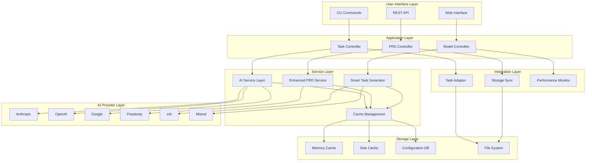

# TaskMaster Integration Phase 2 - Architecture Design

## 🏗️ **System Architecture Overview**

### **High-Level Architecture Diagram**



## 🧩 **Component Architecture**

### **1. AI Service Layer Architecture**

```typescript
// Core AI Service Architecture
interface AIServiceArchitecture {
  providerManager: AIProviderManager;
  modelSelector: ModelSelector;
  requestRouter: RequestRouter;
  responseProcessor: ResponseProcessor;
  fallbackManager: FallbackManager;
  performanceTracker: PerformanceTracker;
}

// AI Provider Manager
class AIProviderManager {
  private providers: Map<string, AIProvider>;
  private healthChecker: ProviderHealthChecker;
  private configManager: ProviderConfigManager;
  
  async registerProvider(provider: AIProvider): Promise<void>;
  async removeProvider(providerId: string): Promise<void>;
  async getAvailableProviders(): Promise<AIProvider[]>;
  async testProviderHealth(providerId: string): Promise<HealthStatus>;
}

// Model Selection System
class ModelSelector {
  private selectionStrategy: SelectionStrategy;
  private performanceHistory: PerformanceHistory;
  private costOptimizer: CostOptimizer;
  
  async selectOptimalModel(
    taskType: TaskType,
    context: RequestContext,
    constraints: SelectionConstraints
  ): Promise<SelectedModel>;
  
  async updateModelPerformance(
    modelId: string,
    performance: PerformanceMetrics
  ): Promise<void>;
}
```

### **2. Enhanced PRD Processing Architecture**

```typescript
// PRD Processing Pipeline
interface PRDProcessingArchitecture {
  documentParser: DocumentParser;
  structureAnalyzer: StructureAnalyzer;
  contentExtractor: ContentExtractor;
  complexityAnalyzer: ComplexityAnalyzer;
  requirementClassifier: RequirementClassifier;
}

// Multi-Format Document Parser
class DocumentParser {
  private parsers: Map<DocumentFormat, FormatParser>;
  
  async parseDocument(
    content: string | Buffer,
    format: DocumentFormat,
    options: ParseOptions
  ): Promise<ParsedDocument>;
  
  async validateDocument(document: ParsedDocument): Promise<ValidationResult>;
  async extractMetadata(document: ParsedDocument): Promise<DocumentMetadata>;
}

// Intelligent Structure Analyzer
class StructureAnalyzer {
  private sectionClassifier: SectionClassifier;
  private hierarchyBuilder: HierarchyBuilder;
  
  async analyzeStructure(document: ParsedDocument): Promise<DocumentStructure>;
  async identifySections(structure: DocumentStructure): Promise<DocumentSection[]>;
  async buildHierarchy(sections: DocumentSection[]): Promise<SectionHierarchy>;
}

// Advanced Content Extractor
class ContentExtractor {
  private requirementExtractor: RequirementExtractor;
  private constraintExtractor: ConstraintExtractor;
  private criteriaExtractor: AcceptanceCriteriaExtractor;
  
  async extractRequirements(
    sections: DocumentSection[],
    context: ExtractionContext
  ): Promise<Requirement[]>;
  
  async extractConstraints(
    sections: DocumentSection[]
  ): Promise<Constraint[]>;
  
  async extractAcceptanceCriteria(
    requirements: Requirement[]
  ): Promise<AcceptanceCriteria[]>;
}
```

### **3. Smart Task Generation Architecture**

```typescript
// Task Generation System
interface TaskGenerationArchitecture {
  taskBreakdown: TaskBreakdownEngine;
  dependencyDetector: DependencyDetector;
  effortEstimator: EffortEstimator;
  sparcMapper: SPARCMapper;
  optimizationEngine: OptimizationEngine;
}

// Intelligent Task Breakdown
class TaskBreakdownEngine {
  private breakdownStrategies: Map<RequirementType, BreakdownStrategy>;
  private contextAnalyzer: ContextAnalyzer;
  
  async breakdownRequirement(
    requirement: Requirement,
    context: ProjectContext
  ): Promise<TaskBreakdown>;
  
  async generateSubtasks(
    parentTask: Task,
    breakdownLevel: number
  ): Promise<Task[]>;
}

// Dependency Detection System
class DependencyDetector {
  private explicitDetector: ExplicitDependencyDetector;
  private implicitDetector: ImplicitDependencyDetector;
  private circularDetector: CircularDependencyDetector;
  
  async detectDependencies(
    tasks: Task[],
    context: ProjectContext
  ): Promise<DependencyGraph>;
  
  async optimizeDependencies(
    graph: DependencyGraph
  ): Promise<OptimizedDependencyGraph>;
}

// Advanced Effort Estimation
class EffortEstimator {
  private baseEstimator: BaseEffortEstimator;
  private complexityAnalyzer: ComplexityAnalyzer;
  private historicalData: HistoricalDataManager;
  private uncertaintyCalculator: UncertaintyCalculator;
  
  async estimateEffort(
    task: Task,
    context: EstimationContext
  ): Promise<EffortEstimate>;
  
  async calibrateEstimates(
    actualEffort: ActualEffort[],
    estimatedEffort: EstimatedEffort[]
  ): Promise<CalibrationResult>;
}
```

## 🔧 **Infrastructure Architecture**

### **1. Caching Architecture**

```typescript
// Multi-Level Caching System
interface CachingArchitecture {
  memoryCache: MemoryCache;
  diskCache: DiskCache;
  distributedCache: DistributedCache;
  cacheStrategy: CacheStrategy;
  evictionPolicy: EvictionPolicy;
}

// Cache Strategy Manager
class CacheStrategy {
  private levels: CacheLevel[];
  private policies: CachePolicy[];
  
  async get(key: string): Promise<CachedItem | null>;
  async set(key: string, value: any, ttl?: number): Promise<void>;
  async invalidate(pattern: string): Promise<void>;
  async getStats(): Promise<CacheStats>;
}

// Intelligent Cache Key Generation
class CacheKeyGenerator {
  async generateKey(
    request: AIRequest,
    context: RequestContext
  ): Promise<string> {
    const components = [
      request.type,
      this.hashContent(request.content),
      context.modelId,
      context.parameters,
      this.getVersion()
    ];
    
    return this.createHash(components);
  }
}
```

### **2. Error Handling & Recovery Architecture**

```typescript
// Comprehensive Error Management
interface ErrorHandlingArchitecture {
  errorClassifier: ErrorClassifier;
  recoveryStrategy: RecoveryStrategy;
  circuitBreaker: CircuitBreaker;
  retryManager: RetryManager;
  alertManager: AlertManager;
}

// Circuit Breaker Implementation
class CircuitBreaker {
  private states: Map<string, CircuitState>;
  private config: CircuitBreakerConfig;
  
  async execute<T>(
    operation: () => Promise<T>,
    serviceId: string
  ): Promise<T> {
    const state = this.getState(serviceId);
    
    if (state === CircuitState.OPEN) {
      if (this.shouldAttemptReset(serviceId)) {
        this.setState(serviceId, CircuitState.HALF_OPEN);
      } else {
        throw new CircuitOpenException(serviceId);
      }
    }
    
    try {
      const result = await operation();
      this.recordSuccess(serviceId);
      return result;
    } catch (error) {
      this.recordFailure(serviceId, error);
      throw error;
    }
  }
}

// Intelligent Retry Manager
class RetryManager {
  private retryPolicies: Map<ErrorType, RetryPolicy>;
  
  async executeWithRetry<T>(
    operation: () => Promise<T>,
    context: RetryContext
  ): Promise<T> {
    let lastError: Error;
    
    for (let attempt = 1; attempt <= context.maxRetries; attempt++) {
      try {
        return await operation();
      } catch (error) {
        lastError = error;
        
        const policy = this.getRetryPolicy(error);
        if (!policy.shouldRetry(error, attempt)) {
          break;
        }
        
        const delay = policy.calculateDelay(attempt);
        await this.sleep(delay);
      }
    }
    
    throw lastError;
  }
}
```

### **3. Performance Monitoring Architecture**

```typescript
// Performance Monitoring System
interface MonitoringArchitecture {
  metricsCollector: MetricsCollector;
  performanceAnalyzer: PerformanceAnalyzer;
  alertSystem: AlertSystem;
  dashboardProvider: DashboardProvider;
}

// Real-time Metrics Collection
class MetricsCollector {
  private collectors: Map<MetricType, Collector>;
  private aggregators: Map<string, Aggregator>;
  
  async collectMetric(
    type: MetricType,
    value: number,
    tags: Tags
  ): Promise<void>;
  
  async getMetrics(
    query: MetricQuery
  ): Promise<MetricResult[]>;
  
  async exportMetrics(
    format: ExportFormat
  ): Promise<string>;
}

// Performance Analysis Engine
class PerformanceAnalyzer {
  private analyzers: Map<AnalysisType, Analyzer>;
  
  async analyzePerformance(
    timeRange: TimeRange,
    components: ComponentFilter[]
  ): Promise<PerformanceReport>;
  
  async detectAnomalies(
    metrics: Metric[]
  ): Promise<Anomaly[]>;
  
  async generateOptimizationRecommendations(
    analysis: PerformanceReport
  ): Promise<OptimizationRecommendation[]>;
}
```

## 🔒 **Security Architecture**

### **1. API Key Management**

```typescript
// Secure Credential Management
interface SecurityArchitecture {
  keyManager: APIKeyManager;
  encryptionService: EncryptionService;
  accessControl: AccessController;
  auditLogger: AuditLogger;
}

// API Key Management System
class APIKeyManager {
  private vault: SecretVault;
  private rotationScheduler: KeyRotationScheduler;
  
  async storeAPIKey(
    providerId: string,
    apiKey: string,
    metadata: KeyMetadata
  ): Promise<void> {
    const encryptedKey = await this.encryptionService.encrypt(apiKey);
    await this.vault.store(providerId, encryptedKey, metadata);
    this.scheduleRotation(providerId, metadata.rotationInterval);
  }
  
  async getAPIKey(providerId: string): Promise<string> {
    const encryptedKey = await this.vault.retrieve(providerId);
    return await this.encryptionService.decrypt(encryptedKey);
  }
  
  async rotateAPIKey(providerId: string): Promise<void> {
    // Implement key rotation logic
  }
}
```

### **2. Rate Limiting & Access Control**

```typescript
// Rate Limiting System
class RateLimiter {
  private limiters: Map<string, TokenBucket>;
  
  async checkLimit(
    identifier: string,
    resource: string
  ): Promise<RateLimitResult> {
    const bucket = this.getLimiter(identifier, resource);
    return bucket.consume();
  }
  
  async updateLimits(
    identifier: string,
    limits: RateLimit[]
  ): Promise<void> {
    // Update rate limits dynamically
  }
}

// Access Control System
class AccessController {
  private permissions: Map<string, Permission[]>;
  private roles: Map<string, Role>;
  
  async checkPermission(
    userId: string,
    resource: string,
    action: string
  ): Promise<boolean> {
    const userPermissions = await this.getUserPermissions(userId);
    return this.hasPermission(userPermissions, resource, action);
  }
}
```

## 📊 **Data Architecture**

### **1. Configuration Management**

```typescript
// Configuration Architecture
interface ConfigurationArchitecture {
  configStore: ConfigurationStore;
  validator: ConfigValidator;
  versionManager: ConfigVersionManager;
  distributor: ConfigDistributor;
}

// Dynamic Configuration System
class ConfigurationManager {
  private store: ConfigurationStore;
  private cache: ConfigurationCache;
  private watchers: Map<string, ConfigWatcher>;
  
  async getConfig<T>(
    key: string,
    type: ConfigType
  ): Promise<T> {
    const cached = await this.cache.get(key);
    if (cached && !this.isExpired(cached)) {
      return cached.value;
    }
    
    const config = await this.store.get(key);
    await this.cache.set(key, config);
    return config;
  }
  
  async updateConfig(
    key: string,
    value: any,
    options: UpdateOptions
  ): Promise<void> {
    await this.validator.validate(key, value);
    await this.store.set(key, value, options);
    await this.notifyWatchers(key, value);
  }
}
```

### **2. Performance Data Storage**

```typescript
// Performance Data Architecture
class PerformanceDataStore {
  private timeSeries: TimeSeriesDB;
  private eventStore: EventStore;
  private aggregator: DataAggregator;
  
  async storeMetric(
    metric: PerformanceMetric
  ): Promise<void> {
    await this.timeSeries.insert(metric);
    await this.aggregator.process(metric);
  }
  
  async queryMetrics(
    query: MetricQuery
  ): Promise<MetricResult[]> {
    return await this.timeSeries.query(query);
  }
  
  async storeEvent(
    event: PerformanceEvent
  ): Promise<void> {
    await this.eventStore.append(event);
    await this.updateAggregates(event);
  }
}
```

## 🚀 **Deployment Architecture**

### **1. Scalability Design**

```typescript
// Horizontal Scaling Architecture
interface ScalingArchitecture {
  loadBalancer: LoadBalancer;
  serviceRegistry: ServiceRegistry;
  healthMonitor: HealthMonitor;
  autoScaler: AutoScaler;
}

// Load Balancing Strategy
class LoadBalancer {
  private strategies: Map<string, BalancingStrategy>;
  private healthChecks: Map<string, HealthCheck>;
  
  async route(
    request: ServiceRequest
  ): Promise<ServiceEndpoint> {
    const strategy = this.getStrategy(request.serviceType);
    const healthyEndpoints = await this.getHealthyEndpoints(request.serviceType);
    return strategy.selectEndpoint(healthyEndpoints, request);
  }
}

// Auto-scaling System
class AutoScaler {
  private scalingPolicies: Map<string, ScalingPolicy>;
  private metrics: MetricsProvider;
  
  async evaluateScaling(
    serviceId: string
  ): Promise<ScalingDecision> {
    const policy = this.scalingPolicies.get(serviceId);
    const currentMetrics = await this.metrics.getMetrics(serviceId);
    
    return policy.evaluate(currentMetrics);
  }
  
  async executeScaling(
    decision: ScalingDecision
  ): Promise<ScalingResult> {
    // Implement scaling logic
  }
}
```

### **2. Monitoring & Observability**

```typescript
// Observability Architecture
interface ObservabilityArchitecture {
  tracing: DistributedTracing;
  logging: StructuredLogging;
  metrics: MetricsCollection;
  alerting: AlertManager;
}

// Distributed Tracing System
class DistributedTracing {
  private tracer: Tracer;
  private spans: Map<string, Span>;
  
  async startSpan(
    operationName: string,
    parentSpan?: Span
  ): Promise<Span> {
    const span = this.tracer.startSpan(operationName, {
      childOf: parentSpan
    });
    
    this.spans.set(span.context().spanId, span);
    return span;
  }
  
  async finishSpan(
    spanId: string,
    result: OperationResult
  ): Promise<void> {
    const span = this.spans.get(spanId);
    if (span) {
      span.setTag('result', result);
      span.finish();
      this.spans.delete(spanId);
    }
  }
}
```

## 📝 **Integration Patterns**

### **1. Event-Driven Architecture**

```typescript
// Event System Architecture
interface EventArchitecture {
  eventBus: EventBus;
  eventStore: EventStore;
  projections: ProjectionManager;
  sagas: SagaManager;
}

// Event Bus Implementation
class EventBus {
  private subscribers: Map<EventType, EventHandler[]>;
  private middleware: EventMiddleware[];
  
  async publish(event: DomainEvent): Promise<void> {
    const processedEvent = await this.applyMiddleware(event);
    const handlers = this.subscribers.get(event.type) || [];
    
    await Promise.all(
      handlers.map(handler => handler.handle(processedEvent))
    );
  }
  
  subscribe(
    eventType: EventType,
    handler: EventHandler
  ): void {
    const handlers = this.subscribers.get(eventType) || [];
    handlers.push(handler);
    this.subscribers.set(eventType, handlers);
  }
}
```

### **2. Plugin Architecture**

```typescript
// Plugin System Architecture
interface PluginArchitecture {
  pluginManager: PluginManager;
  pluginRegistry: PluginRegistry;
  pluginLoader: PluginLoader;
  sandboxManager: SandboxManager;
}

// Plugin Management System
class PluginManager {
  private plugins: Map<string, Plugin>;
  private dependencies: DependencyGraph;
  
  async loadPlugin(
    pluginDefinition: PluginDefinition
  ): Promise<Plugin> {
    await this.validatePlugin(pluginDefinition);
    const plugin = await this.pluginLoader.load(pluginDefinition);
    
    await this.resolveDependencies(plugin);
    await this.initializePlugin(plugin);
    
    this.plugins.set(plugin.id, plugin);
    return plugin;
  }
  
  async executePlugin(
    pluginId: string,
    context: ExecutionContext
  ): Promise<PluginResult> {
    const plugin = this.plugins.get(pluginId);
    if (!plugin) {
      throw new PluginNotFoundException(pluginId);
    }
    
    return await this.sandboxManager.execute(plugin, context);
  }
}
```

---

**Architecture Design Complete** ✅  
**Next**: Proceed to Refinement phase for actual implementation