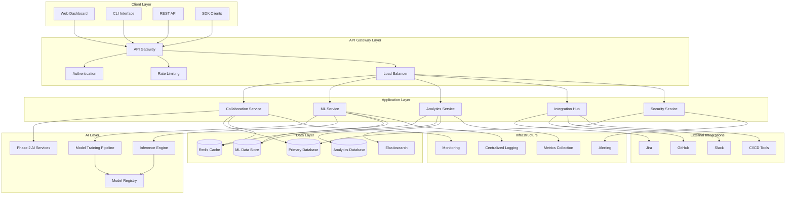

# TaskMaster Integration Phase 3 - Architecture Design

## 🏗️ **System Architecture Overview**

### **High-Level Enterprise Architecture Diagram**



## 🧩 **Component Architecture**

### **1. Team Collaboration Service Architecture**

```typescript
// Real-time Collaboration Architecture
interface CollaborationArchitecture {
  sessionManager: CollaborationSessionManager;
  changeTracker: ChangeTracker;
  conflictResolver: ConflictResolver;
  rtcHandler: RealtimeCommunicationHandler;
  permissionManager: PermissionManager;
}

// Collaboration Session Manager
class CollaborationSessionManager {
  private sessions: Map<SessionId, CollaborationSession>;
  private userSessions: Map<UserId, Set<SessionId>>;
  private rtcConnections: Map<SessionId, RTCConnection>;
  
  async createSession(
    projectId: string,
    initiatorId: string,
    options: SessionOptions
  ): Promise<SessionId> {
    const sessionId = generateSessionId();
    const session = new CollaborationSession({
      id: sessionId,
      projectId,
      initiatorId,
      participants: [initiatorId],
      createdAt: Date.now(),
      options
    });
    
    // Setup real-time communication
    const rtcConnection = await this.setupRTCConnection(sessionId);
    this.rtcConnections.set(sessionId, rtcConnection);
    
    // Initialize conflict resolution
    session.conflictResolver = new ConflictResolver(session);
    
    this.sessions.set(sessionId, session);
    this.addUserToSession(initiatorId, sessionId);
    
    return sessionId;
  }
  
  async joinSession(sessionId: SessionId, userId: string): Promise<void> {
    const session = this.sessions.get(sessionId);
    if (!session) throw new SessionNotFoundError(sessionId);
    
    // Check permissions
    const hasPermission = await this.permissionManager.checkSessionAccess(
      userId, 
      session.projectId
    );
    if (!hasPermission) throw new UnauthorizedAccessError();
    
    // Add user to session
    session.participants.push(userId);
    this.addUserToSession(userId, sessionId);
    
    // Notify other participants
    await this.broadcastUserJoined(sessionId, userId);
    
    // Send current state to new user
    await this.sendSessionState(sessionId, userId);
  }
  
  async broadcastChange(
    sessionId: SessionId,
    change: ChangeEvent,
    fromUserId: string
  ): Promise<void> {
    const session = this.sessions.get(sessionId);
    if (!session) throw new SessionNotFoundError(sessionId);
    
    // Apply change to session state
    const appliedChange = await session.applyChange(change);
    
    // Broadcast to all participants except sender
    const rtcConnection = this.rtcConnections.get(sessionId);
    const participants = session.participants.filter(id => id !== fromUserId);
    
    await Promise.all(
      participants.map(participantId =>
        rtcConnection.sendToUser(participantId, {
          type: 'change',
          change: appliedChange,
          timestamp: Date.now()
        })
      )
    );
  }
}

// Advanced Conflict Resolution System
class ConflictResolver {
  private conflictDetectors: Map<ConflictType, ConflictDetector>;
  private resolutionStrategies: Map<ConflictType, ResolutionStrategy>;
  private mlConflictPredictor: MLConflictPredictor;
  
  constructor(session: CollaborationSession) {
    this.conflictDetectors = new Map([
      ['concurrent_edit', new ConcurrentEditDetector()],
      ['dependency_violation', new DependencyViolationDetector()],
      ['permission_conflict', new PermissionConflictDetector()],
      ['data_inconsistency', new DataInconsistencyDetector()]
    ]);
    
    this.resolutionStrategies = new Map([
      ['concurrent_edit', new ConcurrentEditResolver()],
      ['dependency_violation', new DependencyViolationResolver()],
      ['permission_conflict', new PermissionConflictResolver()],
      ['data_inconsistency', new DataInconsistencyResolver()]
    ]);
    
    this.mlConflictPredictor = new MLConflictPredictor(session.projectId);
  }
  
  async detectConflicts(
    change: ChangeEvent,
    sessionState: SessionState
  ): Promise<Conflict[]> {
    const conflicts: Conflict[] = [];
    
    // Run all conflict detectors
    for (const [type, detector] of this.conflictDetectors) {
      const detectedConflicts = await detector.detect(change, sessionState);
      conflicts.push(...detectedConflicts);
    }
    
    // Predict potential future conflicts using ML
    const predictedConflicts = await this.mlConflictPredictor.predictConflicts(
      change,
      sessionState
    );
    conflicts.push(...predictedConflicts);
    
    return conflicts;
  }
  
  async resolveConflicts(conflicts: Conflict[]): Promise<Resolution> {
    const resolutions: PartialResolution[] = [];
    
    // Resolve each conflict type
    for (const conflict of conflicts) {
      const strategy = this.resolutionStrategies.get(conflict.type);
      if (strategy) {
        const resolution = await strategy.resolve(conflict);
        resolutions.push(resolution);
      }
    }
    
    // Merge resolutions into final resolution
    const finalResolution = await this.mergeResolutions(resolutions);
    
    // Validate resolution doesn't create new conflicts
    const validationResult = await this.validateResolution(finalResolution);
    if (!validationResult.isValid) {
      return this.createManualResolution(conflicts);
    }
    
    return finalResolution;
  }
}
```

### **2. Machine Learning Service Architecture**

```typescript
// ML Service Architecture
interface MLServiceArchitecture {
  dataProcessor: MLDataProcessor;
  modelTrainer: ModelTrainer;
  inferenceEngine: InferenceEngine;
  modelRegistry: ModelRegistry;
  performanceMonitor: MLPerformanceMonitor;
}

// ML Data Processing Pipeline
class MLDataProcessor {
  private featureEngineer: FeatureEngineer;
  private dataValidator: DataValidator;
  private privacyProcessor: PrivacyProcessor;
  
  async processTrainingData(
    rawData: RawProjectData[],
    processingConfig: ProcessingConfig
  ): Promise<ProcessedTrainingData> {
    // Privacy-preserving data processing
    const anonymizedData = await this.privacyProcessor.anonymize(rawData);
    
    // Data validation and cleaning
    const validatedData = await this.dataValidator.validate(anonymizedData);
    
    // Feature engineering
    const features = await this.featureEngineer.extractFeatures(
      validatedData,
      processingConfig.featureConfig
    );
    
    // Split data for training/validation/test
    const dataSplit = await this.splitData(features, processingConfig.splitRatio);
    
    return {
      training: dataSplit.training,
      validation: dataSplit.validation,
      test: dataSplit.test,
      metadata: {
        featureCount: features.featureCount,
        dataPoints: features.dataPoints.length,
        processingTime: Date.now()
      }
    };
  }
  
  async extractFeatures(
    data: ProjectData,
    context: FeatureContext
  ): Promise<FeatureVector> {
    const features: FeatureVector = {};
    
    // Extract requirement features
    features.requirement = await this.extractRequirementFeatures(
      data.requirements
    );
    
    // Extract team features
    features.team = await this.extractTeamFeatures(data.team);
    
    // Extract historical features
    features.historical = await this.extractHistoricalFeatures(
      data.projectId,
      context
    );
    
    // Extract contextual features
    features.contextual = await this.extractContextualFeatures(
      data,
      context
    );
    
    return features;
  }
}

// Model Training Pipeline
class ModelTrainer {
  private trainers: Map<ModelType, TrainerImplementation>;
  private hyperparameterOptimizer: HyperparameterOptimizer;
  private distributedTraining: DistributedTrainingManager;
  
  async trainModel(
    modelType: ModelType,
    trainingData: ProcessedTrainingData,
    config: TrainingConfig
  ): Promise<TrainedModel> {
    const trainer = this.trainers.get(modelType);
    if (!trainer) throw new UnsupportedModelTypeError(modelType);
    
    // Hyperparameter optimization
    const optimizedParams = await this.hyperparameterOptimizer.optimize(
      modelType,
      trainingData.validation,
      config.optimizationConfig
    );
    
    // Distributed training for large datasets
    let model: TrainedModel;
    if (trainingData.training.size > config.distributedThreshold) {
      model = await this.distributedTraining.train(
        trainer,
        trainingData.training,
        optimizedParams
      );
    } else {
      model = await trainer.train(trainingData.training, optimizedParams);
    }
    
    // Model validation
    const validationResults = await this.validateModel(
      model,
      trainingData.validation
    );
    
    // Model testing
    const testResults = await this.testModel(model, trainingData.test);
    
    return {
      model,
      performance: {
        validation: validationResults,
        test: testResults
      },
      metadata: {
        modelType,
        trainingTime: Date.now(),
        hyperparameters: optimizedParams
      }
    };
  }
  
  async improveModel(
    existingModel: TrainedModel,
    newData: ProcessedTrainingData,
    improvementStrategy: 'incremental' | 'retrain' | 'transfer'
  ): Promise<TrainedModel> {
    switch (improvementStrategy) {
      case 'incremental':
        return await this.incrementalTraining(existingModel, newData);
      case 'retrain':
        return await this.retrainModel(existingModel, newData);
      case 'transfer':
        return await this.transferLearning(existingModel, newData);
    }
  }
}

// Inference Engine
class InferenceEngine {
  private modelCache: Map<ModelId, LoadedModel>;
  private loadBalancer: InferenceLoadBalancer;
  private performanceTracker: InferencePerformanceTracker;
  
  async predict<T>(
    modelId: ModelId,
    input: InferenceInput,
    options: InferenceOptions = {}
  ): Promise<Prediction<T>> {
    const model = await this.getModel(modelId);
    
    // Pre-process input
    const processedInput = await this.preprocessInput(input, model.preprocessor);
    
    // Run inference
    const startTime = performance.now();
    const rawPrediction = await model.predict(processedInput);
    const inferenceTime = performance.now() - startTime;
    
    // Post-process output
    const prediction = await this.postprocessOutput(
      rawPrediction,
      model.postprocessor
    );
    
    // Track performance
    await this.performanceTracker.record({
      modelId,
      inferenceTime,
      inputSize: this.calculateInputSize(input),
      timestamp: Date.now()
    });
    
    return {
      result: prediction,
      confidence: rawPrediction.confidence,
      modelId,
      inferenceTime,
      metadata: {
        modelVersion: model.version,
        preprocessingTime: processedInput.processingTime
      }
    };
  }
  
  async batchPredict<T>(
    modelId: ModelId,
    inputs: InferenceInput[],
    options: BatchInferenceOptions = {}
  ): Promise<Prediction<T>[]> {
    const model = await this.getModel(modelId);
    
    // Batch processing for efficiency
    const batchSize = options.batchSize || 32;
    const batches = this.createBatches(inputs, batchSize);
    
    const predictions: Prediction<T>[] = [];
    
    for (const batch of batches) {
      const batchPredictions = await Promise.all(
        batch.map(input => this.predict<T>(modelId, input, options))
      );
      predictions.push(...batchPredictions);
    }
    
    return predictions;
  }
}
```

### **3. Enterprise Integration Hub Architecture**

```typescript
// Enterprise Integration Architecture
interface EnterpriseIntegrationArchitecture {
  integrationManager: IntegrationManager;
  webhookProcessor: WebhookProcessor;
  syncEngine: SyncEngine;
  mappingService: DataMappingService;
  eventBus: IntegrationEventBus;
}

// Integration Manager
class IntegrationManager {
  private integrations: Map<IntegrationType, Integration>;
  private adapters: Map<IntegrationType, IntegrationAdapter>;
  private syncScheduler: SyncScheduler;
  
  async setupIntegration(
    type: IntegrationType,
    config: IntegrationConfig
  ): Promise<Integration> {
    const adapter = this.adapters.get(type);
    if (!adapter) throw new UnsupportedIntegrationError(type);
    
    // Validate configuration
    const validationResult = await adapter.validateConfig(config);
    if (!validationResult.isValid) {
      throw new InvalidConfigError(validationResult.errors);
    }
    
    // Test connectivity
    const connectivityTest = await adapter.testConnectivity(config);
    if (!connectivityTest.success) {
      throw new ConnectivityError(connectivityTest.error);
    }
    
    // Create integration instance
    const integration = await adapter.createIntegration(config);
    
    // Setup webhooks if supported
    if (adapter.supportsWebhooks) {
      await this.setupWebhooks(integration, config);
    }
    
    // Setup sync schedule
    if (config.syncConfig) {
      await this.syncScheduler.schedule(integration, config.syncConfig);
    }
    
    this.integrations.set(type, integration);
    
    return integration;
  }
  
  async syncData(
    integrationType: IntegrationType,
    direction: SyncDirection,
    options: SyncOptions = {}
  ): Promise<SyncResult> {
    const integration = this.integrations.get(integrationType);
    if (!integration) throw new IntegrationNotFoundError(integrationType);
    
    const syncEngine = new SyncEngine(integration);
    
    try {
      const result = await syncEngine.sync(direction, options);
      
      // Emit sync event
      this.eventBus.emit('sync.completed', {
        integrationType,
        direction,
        result
      });
      
      return result;
    } catch (error) {
      // Emit sync error event
      this.eventBus.emit('sync.failed', {
        integrationType,
        direction,
        error
      });
      
      throw error;
    }
  }
}

// Advanced Data Mapping Service
class DataMappingService {
  private mappingRules: Map<string, MappingRule[]>;
  private transformers: Map<string, DataTransformer>;
  private mlMapper: MLDataMapper;
  
  async mapData(
    sourceData: any,
    sourceSchema: Schema,
    targetSchema: Schema,
    mappingContext: MappingContext
  ): Promise<MappedData> {
    // Get mapping rules for this transformation
    const mappingKey = `${sourceSchema.type}_to_${targetSchema.type}`;
    const rules = this.mappingRules.get(mappingKey) || [];
    
    // Apply explicit mapping rules
    let mappedData = await this.applyMappingRules(sourceData, rules);
    
    // Use ML for intelligent field mapping
    const mlSuggestions = await this.mlMapper.suggestMappings(
      sourceData,
      sourceSchema,
      targetSchema,
      mappingContext
    );
    
    // Apply ML-suggested mappings for unmapped fields
    mappedData = await this.applyMLMappings(mappedData, mlSuggestions);
    
    // Validate mapped data against target schema
    const validationResult = await this.validateMappedData(
      mappedData,
      targetSchema
    );
    
    if (!validationResult.isValid) {
      throw new DataMappingError(validationResult.errors);
    }
    
    return {
      data: mappedData,
      mappingMetadata: {
        appliedRules: rules.length,
        mlSuggestions: mlSuggestions.length,
        confidence: this.calculateMappingConfidence(mappedData, mlSuggestions)
      }
    };
  }
  
  async learnMappingPatterns(
    mappingHistory: MappingHistory[]
  ): Promise<void> {
    // Train ML model on successful mappings
    await this.mlMapper.trainOnMappingHistory(mappingHistory);
    
    // Extract new mapping rules from patterns
    const newRules = await this.extractRulesFromPatterns(mappingHistory);
    
    // Update mapping rules
    for (const rule of newRules) {
      const key = `${rule.sourceType}_to_${rule.targetType}`;
      const existingRules = this.mappingRules.get(key) || [];
      existingRules.push(rule);
      this.mappingRules.set(key, existingRules);
    }
  }
}

// Webhook Processing System
class WebhookProcessor {
  private webhookHandlers: Map<string, WebhookHandler>;
  private rateLimiter: WebhookRateLimiter;
  private authenticator: WebhookAuthenticator;
  private eventQueue: WebhookEventQueue;
  
  async processWebhook(
    webhookData: WebhookPayload,
    headers: WebhookHeaders
  ): Promise<WebhookProcessingResult> {
    // Authenticate webhook
    const authResult = await this.authenticator.authenticate(
      webhookData,
      headers
    );
    if (!authResult.isValid) {
      throw new WebhookAuthenticationError();
    }
    
    // Rate limiting
    const rateLimitResult = await this.rateLimiter.checkLimit(
      headers['x-webhook-source'],
      webhookData.eventType
    );
    if (!rateLimitResult.allowed) {
      throw new WebhookRateLimitError(rateLimitResult.retryAfter);
    }
    
    // Get appropriate handler
    const handler = this.webhookHandlers.get(webhookData.eventType);
    if (!handler) {
      throw new UnsupportedWebhookEventError(webhookData.eventType);
    }
    
    // Queue event for processing
    const eventId = await this.eventQueue.enqueue({
      webhookData,
      handler,
      timestamp: Date.now(),
      retryCount: 0
    });
    
    // Process event asynchronously
    this.processEventAsync(eventId);
    
    return {
      eventId,
      status: 'queued',
      estimatedProcessingTime: handler.estimatedProcessingTime
    };
  }
  
  private async processEventAsync(eventId: string): Promise<void> {
    const event = await this.eventQueue.dequeue(eventId);
    
    try {
      const result = await event.handler.handle(event.webhookData);
      
      // Update event status
      await this.eventQueue.markComplete(eventId, result);
      
      // Emit processing complete event
      this.eventBus.emit('webhook.processed', {
        eventId,
        eventType: event.webhookData.eventType,
        result
      });
    } catch (error) {
      // Handle retry logic
      if (event.retryCount < MAX_RETRY_COUNT) {
        event.retryCount++;
        await this.eventQueue.enqueue(event);
      } else {
        await this.eventQueue.markFailed(eventId, error);
        
        // Emit processing failed event
        this.eventBus.emit('webhook.failed', {
          eventId,
          eventType: event.webhookData.eventType,
          error
        });
      }
    }
  }
}
```

### **4. Advanced Analytics Service Architecture**

```typescript
// Analytics Service Architecture
interface AnalyticsServiceArchitecture {
  dataCollector: AnalyticsDataCollector;
  processor: AnalyticsProcessor;
  predictor: PredictiveAnalytics;
  reporter: ReportGenerator;
  dashboard: DashboardService;
}

// Real-time Analytics Data Collector
class AnalyticsDataCollector {
  private eventStream: EventStream;
  private aggregator: RealTimeAggregator;
  private storage: AnalyticsStorage;
  
  async collectEvent(event: AnalyticsEvent): Promise<void> {
    // Add timestamp and metadata
    const enrichedEvent = {
      ...event,
      timestamp: Date.now(),
      sessionId: this.getSessionId(),
      userId: this.getUserId()
    };
    
    // Stream to real-time processing
    await this.eventStream.publish(enrichedEvent);
    
    // Update real-time aggregations
    await this.aggregator.update(enrichedEvent);
    
    // Store for historical analysis
    await this.storage.store(enrichedEvent);
  }
  
  async collectMetrics(metrics: PerformanceMetrics): Promise<void> {
    // Process performance metrics
    const processedMetrics = await this.processMetrics(metrics);
    
    // Update real-time dashboards
    await this.updateDashboards(processedMetrics);
    
    // Check for anomalies
    const anomalies = await this.detectAnomalies(processedMetrics);
    if (anomalies.length > 0) {
      await this.alertManager.sendAnomalyAlerts(anomalies);
    }
  }
}

// Predictive Analytics Engine
class PredictiveAnalytics {
  private timeSeriesModels: Map<MetricType, TimeSeriesModel>;
  private riskModels: Map<RiskType, RiskModel>;
  private trendAnalyzer: TrendAnalyzer;
  
  async predictProjectOutcome(
    projectId: string,
    predictionHorizon: number
  ): Promise<ProjectPrediction> {
    const projectData = await this.getProjectData(projectId);
    const features = await this.extractPredictionFeatures(projectData);
    
    // Predict various aspects
    const schedulePrediction = await this.predictSchedule(features, predictionHorizon);
    const budgetPrediction = await this.predictBudget(features, predictionHorizon);
    const qualityPrediction = await this.predictQuality(features, predictionHorizon);
    const riskPrediction = await this.predictRisks(features, predictionHorizon);
    
    return {
      projectId,
      predictionHorizon,
      schedule: schedulePrediction,
      budget: budgetPrediction,
      quality: qualityPrediction,
      risks: riskPrediction,
      confidence: this.calculateOverallConfidence([
        schedulePrediction,
        budgetPrediction,
        qualityPrediction,
        riskPrediction
      ]),
      generatedAt: Date.now()
    };
  }
  
  async analyzeTeamTrends(
    teamId: string,
    timeRange: TimeRange
  ): Promise<TeamTrendAnalysis> {
    const teamData = await this.getTeamData(teamId, timeRange);
    
    // Analyze productivity trends
    const productivityTrend = await this.trendAnalyzer.analyzeTrend(
      teamData.productivityMetrics,
      'productivity'
    );
    
    // Analyze quality trends
    const qualityTrend = await this.trendAnalyzer.analyzeTrend(
      teamData.qualityMetrics,
      'quality'
    );
    
    // Analyze collaboration trends
    const collaborationTrend = await this.trendAnalyzer.analyzeTrend(
      teamData.collaborationMetrics,
      'collaboration'
    );
    
    // Generate insights and recommendations
    const insights = await this.generateTeamInsights([
      productivityTrend,
      qualityTrend,
      collaborationTrend
    ]);
    
    return {
      teamId,
      timeRange,
      trends: {
        productivity: productivityTrend,
        quality: qualityTrend,
        collaboration: collaborationTrend
      },
      insights,
      recommendations: await this.generateTeamRecommendations(insights)
    };
  }
}
```

### **5. Security & Compliance Architecture**

```typescript
// Security Service Architecture
interface SecurityServiceArchitecture {
  accessControl: AdvancedAccessControl;
  encryption: EncryptionService;
  auditing: ComprehensiveAuditing;
  monitoring: SecurityMonitoring;
  compliance: ComplianceManager;
}

// Advanced Access Control System
class AdvancedAccessControl {
  private rbacEngine: RBACEngine;
  private abacEngine: ABACEngine;
  private riskEngine: RiskBasedAccessEngine;
  private policyEngine: PolicyEngine;
  
  async evaluateAccess(
    request: AccessRequest,
    context: AccessContext
  ): Promise<AccessDecision> {
    const evaluations: AccessEvaluation[] = [];
    
    // Role-based evaluation
    const rbacEval = await this.rbacEngine.evaluate(request, context);
    evaluations.push(rbacEval);
    
    // Attribute-based evaluation
    const abacEval = await this.abacEngine.evaluate(request, context);
    evaluations.push(abacEval);
    
    // Risk-based evaluation
    const riskEval = await this.riskEngine.evaluate(request, context);
    evaluations.push(riskEval);
    
    // Policy-based evaluation
    const policyEval = await this.policyEngine.evaluate(request, context);
    evaluations.push(policyEval);
    
    // Combine evaluations
    const decision = await this.combineEvaluations(evaluations);
    
    // Log access decision
    await this.auditAccess(request, context, decision, evaluations);
    
    return decision;
  }
  
  private async combineEvaluations(
    evaluations: AccessEvaluation[]
  ): Promise<AccessDecision> {
    // Implement sophisticated decision combination logic
    const weights = {
      rbac: 0.3,
      abac: 0.25,
      risk: 0.25,
      policy: 0.2
    };
    
    let totalScore = 0;
    let totalWeight = 0;
    
    for (const eval of evaluations) {
      const weight = weights[eval.type] || 0;
      totalScore += eval.score * weight;
      totalWeight += weight;
    }
    
    const finalScore = totalScore / totalWeight;
    
    return {
      allowed: finalScore >= ACCESS_THRESHOLD,
      score: finalScore,
      reasoning: this.generateAccessReasoning(evaluations),
      additionalRequirements: this.determineAdditionalRequirements(evaluations),
      restrictions: this.determineAccessRestrictions(evaluations)
    };
  }
}

// Comprehensive Compliance Manager
class ComplianceManager {
  private complianceFrameworks: Map<string, ComplianceFramework>;
  private auditTrails: Map<string, AuditTrail>;
  private reportGenerator: ComplianceReportGenerator;
  
  async ensureCompliance(
    operation: Operation,
    data: any,
    context: ComplianceContext
  ): Promise<ComplianceResult> {
    const applicableFrameworks = await this.getApplicableFrameworks(
      operation,
      data,
      context
    );
    
    const complianceChecks: ComplianceCheck[] = [];
    
    for (const framework of applicableFrameworks) {
      const checks = await framework.getRequiredChecks(operation, data);
      
      for (const check of checks) {
        const result = await this.performComplianceCheck(check, data, context);
        complianceChecks.push({
          framework: framework.name,
          check: check.name,
          result,
          severity: check.severity
        });
      }
    }
    
    // Determine overall compliance status
    const overallCompliance = this.evaluateOverallCompliance(complianceChecks);
    
    // Log compliance evaluation
    await this.logComplianceEvaluation(operation, complianceChecks, overallCompliance);
    
    return {
      compliant: overallCompliance.isCompliant,
      frameworks: applicableFrameworks.map(f => f.name),
      checks: complianceChecks,
      violations: overallCompliance.violations,
      recommendations: overallCompliance.recommendations
    };
  }
  
  async generateComplianceReport(
    framework: string,
    timeRange: TimeRange,
    options: ReportOptions = {}
  ): Promise<ComplianceReport> {
    const auditData = await this.collectAuditData(framework, timeRange);
    
    return await this.reportGenerator.generate({
      framework,
      timeRange,
      auditData,
      includeViolations: options.includeViolations ?? true,
      includeRecommendations: options.includeRecommendations ?? true,
      format: options.format ?? 'pdf'
    });
  }
}
```

## 📊 **Data Architecture**

### **Multi-Database Architecture**

```typescript
// Data Layer Architecture
interface DataLayerArchitecture {
  primaryDB: PostgreSQLCluster;
  analyticsDB: ClickHouseCluster;
  mlDataStore: MLDataLake;
  cache: RedisCluster;
  search: ElasticsearchCluster;
  timeSeries: InfluxDBCluster;
}

// Database Sharding Strategy
class DatabaseShardingManager {
  private shards: Map<ShardKey, DatabaseShard>;
  private routingTable: ShardRoutingTable;
  
  async routeQuery(query: DatabaseQuery): Promise<DatabaseShard[]> {
    const shardKeys = await this.determineShardKeys(query);
    return shardKeys.map(key => this.shards.get(key)).filter(Boolean);
  }
  
  async rebalanceShards(): Promise<RebalanceResult> {
    const shardMetrics = await this.collectShardMetrics();
    const rebalancePlan = await this.createRebalancePlan(shardMetrics);
    
    if (rebalancePlan.requiresRebalancing) {
      return await this.executeRebalance(rebalancePlan);
    }
    
    return { rebalanced: false, reason: 'No rebalancing needed' };
  }
}
```

## 🚀 **Deployment Architecture**

### **Microservices Deployment**

```typescript
// Container Orchestration
interface DeploymentArchitecture {
  serviceDiscovery: ServiceRegistry;
  loadBalancer: IntelligentLoadBalancer;
  autoScaler: HorizontalAutoScaler;
  healthMonitor: ServiceHealthMonitor;
  deploymentManager: BlueGreenDeployment;
}

// Auto-scaling Configuration
class HorizontalAutoScaler {
  private scalingPolicies: Map<ServiceName, ScalingPolicy>;
  private metricsCollector: MetricsCollector;
  
  async scale(serviceName: ServiceName): Promise<ScalingDecision> {
    const policy = this.scalingPolicies.get(serviceName);
    const metrics = await this.metricsCollector.getMetrics(serviceName);
    
    const decision = await this.evaluateScaling(policy, metrics);
    
    if (decision.shouldScale) {
      await this.executeScaling(serviceName, decision);
    }
    
    return decision;
  }
}
```

---

**Architecture Design Complete** ✅  
**Next**: Proceed to Refinement phase for implementation