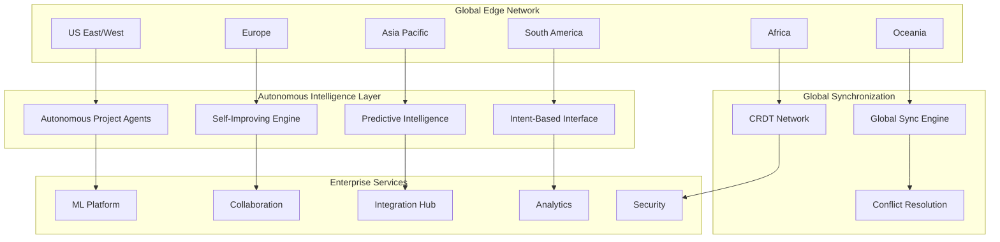

# TaskMaster Integration - Phase 4 Architecture
## Autonomous Intelligence & Global Scale Operations

### System Architecture Overview

Phase 4 introduces a revolutionary autonomous intelligence architecture that operates at planetary scale while maintaining sub-100ms response times globally. The system is designed around three core principles: **Autonomous Operations**, **Self-Improving Intelligence**, and **Global Scale Resilience**.



### Core Architectural Components

#### 1. Autonomous Intelligence Control Plane

```typescript
interface AutonomousControlPlane {
  // Central nervous system for autonomous operations
  agents: {
    projectDirector: AutonomousProjectDirector;
    resourceOptimizer: ResourceOptimizationAgent;
    riskMitigator: RiskMitigationAgent;
    qualityAssurer: QualityAssuranceAgent;
    stakeholderCommunicator: StakeholderCommunicationAgent;
    timelineOptimizer: TimelineOptimizationAgent;
  };
  
  // Self-improving intelligence engine
  selfImprovement: {
    algorithmEvolution: AlgorithmEvolutionEngine;
    performanceLearning: PerformanceLearningLoop;
    userBehaviorAnalysis: UserBehaviorAnalysisEngine;
    featureEngineering: AutomatedFeatureEngineering;
    architectureSearch: NeuralArchitectureSearch;
    feedbackIntegration: FeedbackIntegrationSystem;
  };
  
  // Decision making and execution
  decisionEngine: AutonomousDecisionEngine;
  executionEngine: AutonomousExecutionEngine;
  escalationMatrix: EscalationMatrix;
}
```

#### 2. Global Scale Infrastructure

```typescript
interface GlobalScaleArchitecture {
  // Multi-region deployment
  regions: {
    primary: Region[];
    secondary: Region[];
    edge: EdgeLocation[];
  };
  
  // Global data layer
  dataLayer: {
    crdt: CRDTNetwork;
    globalSync: GlobalSynchronizationEngine;
    eventSourcing: EventSourcingSystem;
    distributedCache: DistributedCacheLayer;
  };
  
  // Performance and reliability
  performance: {
    loadBalancer: GlobalLoadBalancer;
    cdn: ContentDeliveryNetwork;
    caching: IntelligentCachingSystem;
    compression: AdaptiveCompressionEngine;
  };
  
  // Fault tolerance
  faultTolerance: {
    circuitBreaker: CircuitBreakerPattern;
    bulkhead: BulkheadIsolation;
    timeoutManagement: TimeoutManagementSystem;
    gracefulDegradation: GracefulDegradationSystem;
  };
}
```

### Autonomous Agent Architecture

#### Project Director Agent System

```typescript
class AutonomousProjectDirector {
  private knowledgeBase: ProjectKnowledgeBase;
  private decisionEngine: AutonomousDecisionEngine;
  private learningModule: ContinuousLearningModule;
  private stakeholderManager: StakeholderManager;
  private riskAnalyzer: RiskAnalyzer;
  
  // Core autonomous operations
  async autonomousProjectManagement(): Promise<void> {
    while (this.project.isActive()) {
      const context = await this.assessProjectContext();
      const decisions = await this.decisionEngine.generateDecisions(context);
      
      for (const decision of decisions) {
        if (this.shouldExecuteAutonomously(decision)) {
          const result = await this.executeDecision(decision);
          await this.learningModule.learn(decision, result);
        } else {
          await this.escalateToHuman(decision);
        }
      }
      
      await this.adaptiveWait();
    }
  }
  
  // Intelligent decision making
  private shouldExecuteAutonomously(decision: Decision): boolean {
    return decision.confidence > 0.8 && 
           decision.riskLevel < 0.3 && 
           decision.impact < this.autonomyThreshold;
  }
  
  // Continuous learning from outcomes
  async updateAutonomyCapabilities(outcomes: DecisionOutcome[]): Promise<void> {
    const insights = await this.learningModule.analyzeOutcomes(outcomes);
    
    // Adjust autonomy thresholds based on success rates
    if (insights.successRate > 0.95) {
      this.autonomyThreshold *= 1.1; // Increase autonomy
    } else if (insights.successRate < 0.85) {
      this.autonomyThreshold *= 0.9; // Decrease autonomy
    }
    
    // Update decision models
    await this.decisionEngine.updateModels(insights);
  }
}
```

#### Self-Improving Algorithm Engine

```typescript
class SelfImprovingAlgorithmEngine {
  private modelRegistry: ModelRegistry;
  private experimentationFramework: AutoMLExperimentationFramework;
  private performanceTracker: PerformanceTracker;
  private evolutionEngine: AlgorithmEvolutionEngine;
  
  // Continuous improvement cycle
  async continuousImprovement(): Promise<void> {
    while (true) {
      const currentPerformance = await this.performanceTracker.getCurrentMetrics();
      const improvements = await this.discoverImprovements();
      
      for (const improvement of improvements) {
        const testResult = await this.experimentationFramework.testImprovement(improvement);
        
        if (this.isSignificantImprovement(testResult)) {
          await this.deployImprovement(improvement);
        }
      }
      
      await this.adaptiveImprovementInterval();
    }
  }
  
  // Multi-dimensional algorithm evolution
  async discoverImprovements(): Promise<AlgorithmImprovement[]> {
    const improvements: AlgorithmImprovement[] = [];
    
    // Feature engineering evolution
    const newFeatures = await this.evolutionEngine.evolveFeatures();
    improvements.push(...newFeatures);
    
    // Model architecture optimization
    const architectureImprovements = await this.evolutionEngine.optimizeArchitecture();
    improvements.push(...architectureImprovements);
    
    // Hyperparameter optimization
    const hyperparameterOptimizations = await this.evolutionEngine.optimizeHyperparameters();
    improvements.push(...hyperparameterOptimizations);
    
    // Ensemble method evolution
    const ensembleImprovements = await this.evolutionEngine.evolveEnsembleMethods();
    improvements.push(...ensembleImprovements);
    
    return improvements;
  }
  
  // Safe deployment with rollback capability
  private async deployImprovement(improvement: AlgorithmImprovement): Promise<void> {
    const rollbackPoint = await this.createRollbackPoint();
    
    try {
      await this.gradualRollout(improvement);
      const postDeploymentMetrics = await this.monitorImprovement(improvement);
      
      if (!this.meetsQualityGates(postDeploymentMetrics)) {
        await this.rollback(rollbackPoint);
      }
    } catch (error) {
      await this.rollback(rollbackPoint);
      throw error;
    }
  }
}
```

### Global Synchronization Architecture

#### CRDT-Based Global State Management

```typescript
class GlobalStateManager {
  private crdtNetwork: CRDTNetwork;
  private vectorClock: VectorClock;
  private conflictResolver: ConflictResolver;
  private syncOptimizer: SynchronizationOptimizer;
  
  // Global state synchronization
  async synchronizeGlobalState(localChanges: StateChange[]): Promise<SyncResult> {
    const optimizedSyncPlan = await this.syncOptimizer.createSyncPlan(localChanges);
    
    // Parallel synchronization across regions
    const syncPromises = optimizedSyncPlan.regions.map(region => 
      this.syncWithRegion(region, localChanges)
    );
    
    const syncResults = await Promise.allSettled(syncPromises);
    
    // Handle conflicts and partial failures
    const conflicts = this.extractConflicts(syncResults);
    if (conflicts.length > 0) {
      const resolvedState = await this.resolveConflicts(conflicts);
      await this.propagateResolvedState(resolvedState);
    }
    
    return this.createSyncResult(syncResults, conflicts);
  }
  
  // Intelligent conflict resolution
  private async resolveConflicts(conflicts: Conflict[]): Promise<ResolvedState> {
    const resolutionStrategies: Map<ConflictType, ResolutionStrategy> = new Map([
      ['concurrent_edit', new ConcurrentEditResolver()],
      ['dependency_violation', new DependencyViolationResolver()],
      ['resource_conflict', new ResourceConflictResolver()],
      ['permission_conflict', new PermissionConflictResolver()],
    ]);
    
    const resolvedChanges: StateChange[] = [];
    
    for (const conflict of conflicts) {
      const strategy = resolutionStrategies.get(conflict.type);
      if (strategy) {
        const resolution = await strategy.resolve(conflict);
        resolvedChanges.push(resolution);
      } else {
        // Escalate complex conflicts to autonomous decision engine
        const decision = await this.escalateConflict(conflict);
        resolvedChanges.push(decision);
      }
    }
    
    return this.mergeResolvedChanges(resolvedChanges);
  }
}
```

#### Real-time Global Event Streaming

```typescript
class GlobalEventStreamingArchitecture {
  private eventStore: DistributedEventStore;
  private streamProcessor: StreamProcessor;
  private eventRouter: EventRouter;
  private subscriptionManager: SubscriptionManager;
  
  // High-throughput event processing
  async processGlobalEventStream(): Promise<void> {
    const eventStream = await this.eventStore.createGlobalStream();
    
    // Parallel processing with backpressure handling
    await this.streamProcessor.process(eventStream, {
      parallelism: this.calculateOptimalParallelism(),
      backpressureStrategy: 'drop_oldest',
      errorHandling: 'retry_with_exponential_backoff',
      
      // Event processing pipeline
      pipeline: [
        this.deduplicationStage,
        this.enrichmentStage,
        this.validationStage,
        this.routingStage,
        this.deliveryStage,
      ]
    });
  }
  
  // Intelligent event routing
  private async routingStage(event: GlobalEvent): Promise<void> {
    const subscriptions = await this.subscriptionManager.getSubscriptions(event);
    
    // Geographic optimization
    const routingPlan = await this.eventRouter.optimizeRouting(event, subscriptions);
    
    // Parallel delivery with retry logic
    const deliveryPromises = routingPlan.routes.map(route => 
      this.deliverEvent(event, route)
    );
    
    await Promise.allSettled(deliveryPromises);
  }
}
```

### Autonomous Deployment Architecture

#### Self-Healing Infrastructure

```typescript
class SelfHealingInfrastructure {
  private healthMonitor: HealthMonitor;
  private diagnosticEngine: DiagnosticEngine;
  private healingStrategies: HealingStrategyRegistry;
  private orchestrator: DeploymentOrchestrator;
  
  // Continuous health monitoring and healing
  async continuousHealing(): Promise<void> {
    while (true) {
      const healthReport = await this.healthMonitor.assessSystemHealth();
      
      const unhealthyComponents = healthReport.components.filter(
        component => component.health < this.healthThreshold
      );
      
      // Parallel healing of unhealthy components
      const healingPromises = unhealthyComponents.map(component => 
        this.healComponent(component)
      );
      
      await Promise.allSettled(healingPromises);
      
      await this.adaptiveHealthCheckInterval();
    }
  }
  
  // Intelligent component healing
  private async healComponent(component: Component): Promise<HealingResult> {
    const diagnosis = await this.diagnosticEngine.diagnose(component);
    const strategy = await this.healingStrategies.selectBestStrategy(diagnosis);
    
    if (strategy.confidence > this.autonomousHealingThreshold) {
      return await this.executeHealingStrategy(component, strategy);
    } else {
      return await this.escalateToHumanIntervention(component, diagnosis);
    }
  }
  
  // Safe healing execution with rollback
  private async executeHealingStrategy(
    component: Component, 
    strategy: HealingStrategy
  ): Promise<HealingResult> {
    const backup = await this.createComponentBackup(component);
    
    try {
      const result = await strategy.execute(component);
      
      // Verify healing success
      const postHealingHealth = await this.healthMonitor.assessComponentHealth(component);
      
      if (postHealingHealth.health >= this.healthThreshold) {
        await this.cleanupBackup(backup);
        return HealingResult.success(strategy, postHealingHealth);
      } else {
        await this.restoreFromBackup(component, backup);
        return HealingResult.failure(strategy, postHealingHealth);
      }
    } catch (error) {
      await this.restoreFromBackup(component, backup);
      throw error;
    }
  }
}
```

#### Progressive Deployment System

```typescript
class ProgressiveDeploymentSystem {
  private canaryAnalyzer: CanaryAnalyzer;
  private trafficRouter: TrafficRouter;
  private rollbackManager: RollbackManager;
  private metricsCollector: MetricsCollector;
  
  // Automated progressive deployment
  async progressiveDeployment(
    deployment: Deployment,
    strategy: DeploymentStrategy
  ): Promise<DeploymentResult> {
    const phases = strategy.phases; // e.g., [1%, 5%, 25%, 50%, 100%]
    
    for (const phase of phases) {
      const phaseResult = await this.executeDeploymentPhase(deployment, phase);
      
      if (!phaseResult.success) {
        await this.rollbackManager.rollback(deployment, phase);
        return DeploymentResult.failure(phaseResult);
      }
      
      // Automated canary analysis
      const canaryResults = await this.canaryAnalyzer.analyze(deployment, phase);
      
      if (!this.passesCanaryGates(canaryResults)) {
        await this.rollbackManager.rollback(deployment, phase);
        return DeploymentResult.canaryFailure(canaryResults);
      }
      
      // Wait for stabilization before next phase
      await this.waitForStabilization(phase);
    }
    
    return DeploymentResult.success();
  }
  
  // Intelligent canary analysis
  private async analyze(deployment: Deployment, phase: DeploymentPhase): Promise<CanaryAnalysis> {
    const metrics = await this.metricsCollector.collectMetrics(deployment, phase);
    
    // Multi-dimensional analysis
    const performanceAnalysis = await this.analyzePerformance(metrics);
    const errorRateAnalysis = await this.analyzeErrorRates(metrics);
    const userExperienceAnalysis = await this.analyzeUserExperience(metrics);
    const businessMetricsAnalysis = await this.analyzeBusinessMetrics(metrics);
    
    // AI-powered anomaly detection
    const anomalies = await this.detectAnomalies(metrics);
    
    return new CanaryAnalysis({
      performance: performanceAnalysis,
      errorRates: errorRateAnalysis,
      userExperience: userExperienceAnalysis,
      businessMetrics: businessMetricsAnalysis,
      anomalies: anomalies,
      overallScore: this.calculateOverallScore([
        performanceAnalysis,
        errorRateAnalysis,
        userExperienceAnalysis,
        businessMetricsAnalysis
      ])
    });
  }
}
```

### Intent-Based Management Architecture

#### Natural Language Processing Pipeline

```typescript
class IntentBasedManagementSystem {
  private nlpProcessor: AdvancedNLPProcessor;
  private intentClassifier: IntentClassifier;
  private contextEngine: ContextEngine;
  private projectGenerator: AutomatedProjectGenerator;
  
  // Natural language to project pipeline
  async processNaturalLanguageRequest(
    userInput: string,
    userContext: UserContext
  ): Promise<ProjectManagementResult> {
    // Multi-stage NLP processing
    const parsedInput = await this.nlpProcessor.parse(userInput);
    const enrichedContext = await this.contextEngine.enrichContext(userContext);
    const intent = await this.intentClassifier.classify(parsedInput, enrichedContext);
    
    // Route to appropriate handler
    switch (intent.type) {
      case 'create_project':
        return await this.handleProjectCreation(parsedInput, enrichedContext);
      case 'modify_project':
        return await this.handleProjectModification(parsedInput, enrichedContext);
      case 'query_status':
        return await this.handleStatusQuery(parsedInput, enrichedContext);
      case 'optimize_project':
        return await this.handleProjectOptimization(parsedInput, enrichedContext);
      default:
        return await this.handleClarificationRequest(parsedInput, enrichedContext);
    }
  }
  
  // Intelligent project generation from natural language
  private async handleProjectCreation(
    parsedInput: ParsedInput,
    context: EnrichedContext
  ): Promise<ProjectCreationResult> {
    // Extract project requirements
    const requirements = await this.extractRequirements(parsedInput);
    const constraints = await this.extractConstraints(parsedInput);
    const preferences = await this.extractPreferences(parsedInput, context);
    
    // Generate comprehensive project plan
    const projectPlan = await this.projectGenerator.generatePlan({
      requirements,
      constraints,
      preferences,
      organizationContext: context.organization,
      historicalData: context.historicalProjects,
      marketData: await this.fetchMarketData(requirements.domain)
    });
    
    // Intelligent resource allocation
    const resourcePlan = await this.allocateResources(projectPlan, context);
    
    // Risk assessment and mitigation
    const riskAssessment = await this.assessRisks(projectPlan, resourcePlan);
    
    // Timeline optimization
    const optimizedTimeline = await this.optimizeTimeline(projectPlan, resourcePlan);
    
    // Budget estimation
    const budgetEstimate = await this.estimateBudget(resourcePlan, optimizedTimeline);
    
    return new ProjectCreationResult({
      projectPlan,
      resourcePlan,
      riskAssessment,
      optimizedTimeline,
      budgetEstimate,
      confidence: this.calculatePlanConfidence(projectPlan)
    });
  }
}
```

### Federated Learning Architecture

#### Cross-Organization Learning Network

```typescript
class FederatedLearningNetwork {
  private participants: Map<string, Organization>;
  private privacyEngine: DifferentialPrivacyEngine;
  private aggregator: SecureAggregator;
  private modelRegistry: GlobalModelRegistry;
  
  // Privacy-preserving federated training
  async federatedTraining(
    trainingRound: FederatedTrainingRound
  ): Promise<FederatedModelUpdate> {
    const participantUpdates: EncryptedModelUpdate[] = [];
    
    // Collect encrypted model updates from participants
    for (const participant of this.participants.values()) {
      const localUpdate = await participant.computeLocalUpdate(trainingRound.globalModel);
      
      // Apply differential privacy
      const privateUpdate = await this.privacyEngine.addNoise(
        localUpdate,
        participant.privacyBudget
      );
      
      // Encrypt for secure aggregation
      const encryptedUpdate = await this.encrypt(privateUpdate, participant.publicKey);
      participantUpdates.push(encryptedUpdate);
    }
    
    // Secure aggregation without revealing individual updates
    const aggregatedUpdate = await this.aggregator.secureAggregate(participantUpdates);
    
    // Update global model
    const newGlobalModel = await this.applyUpdate(trainingRound.globalModel, aggregatedUpdate);
    
    // Validate improvement
    const validation = await this.validateModel(newGlobalModel);
    
    if (validation.improvement > this.improvementThreshold) {
      await this.modelRegistry.publishModel(newGlobalModel);
      return FederatedModelUpdate.success(newGlobalModel, validation);
    } else {
      return FederatedModelUpdate.noImprovement(validation);
    }
  }
  
  // Knowledge distillation across organizations
  async crossOrganizationKnowledgeDistillation(
    sourceModels: Model[],
    targetDomain: string
  ): Promise<DistilledModel> {
    // Create teacher ensemble from relevant models
    const teacherEnsemble = await this.createTeacherEnsemble(sourceModels, targetDomain);
    
    // Generate synthetic training data
    const syntheticData = await this.generateSyntheticData(targetDomain);
    
    // Distill knowledge into domain-specific model
    const studentModel = await this.initializeStudentModel(targetDomain);
    
    // Iterative distillation with privacy preservation
    for (let epoch = 0; epoch < this.distillationEpochs; epoch++) {
      for (const batch of syntheticData) {
        const teacherPredictions = await teacherEnsemble.predict(batch);
        const studentPredictions = await studentModel.predict(batch);
        
        const distillationLoss = this.calculateDistillationLoss(
          teacherPredictions,
          studentPredictions
        );
        
        await studentModel.backpropagate(distillationLoss);
      }
    }
    
    // Validate distilled model
    const validation = await this.validateDistilledModel(studentModel, targetDomain);
    
    return new DistilledModel(studentModel, validation);
  }
}
```

### Performance and Monitoring Architecture

#### Real-time Performance Monitoring

```typescript
class GlobalPerformanceMonitoring {
  private metricsCollector: DistributedMetricsCollector;
  private anomalyDetector: AnomalyDetectionEngine;
  private alertManager: AlertManager;
  private performanceOptimizer: PerformanceOptimizer;
  
  // Continuous performance monitoring
  async continuousMonitoring(): Promise<void> {
    const metricsStream = await this.metricsCollector.createGlobalMetricsStream();
    
    await this.processMetricsStream(metricsStream, {
      windowSize: '1m',
      aggregationInterval: '10s',
      
      processors: [
        this.anomalyDetectionProcessor,
        this.performanceAnalysisProcessor,
        this.capacityPlanningProcessor,
        this.alertGenerationProcessor,
      ]
    });
  }
  
  // AI-powered anomaly detection
  private async anomalyDetectionProcessor(metrics: MetricsBatch): Promise<void> {
    const anomalies = await this.anomalyDetector.detectAnomalies(metrics);
    
    for (const anomaly of anomalies) {
      const severity = await this.classifySeverity(anomaly);
      
      if (severity >= AlertSeverity.WARNING) {
        await this.alertManager.generateAlert(anomaly, severity);
      }
      
      if (severity >= AlertSeverity.CRITICAL) {
        await this.triggerAutomaticMitigation(anomaly);
      }
    }
  }
  
  // Predictive performance optimization
  private async performanceAnalysisProcessor(metrics: MetricsBatch): Promise<void> {
    const performanceAnalysis = await this.analyzePerformance(metrics);
    
    // Predict performance degradation
    const degradationPrediction = await this.predictPerformanceDegradation(performanceAnalysis);
    
    if (degradationPrediction.probability > 0.7) {
      const optimizations = await this.performanceOptimizer.generateOptimizations(
        degradationPrediction
      );
      
      await this.scheduleOptimizations(optimizations);
    }
  }
}
```

### Security Architecture

#### Zero-Trust Security Framework

```typescript
class ZeroTrustSecurityArchitecture {
  private identityVerifier: IdentityVerifier;
  private behavioralAnalyzer: BehavioralAnalyzer;
  private threatDetector: ThreatDetector;
  private policyEngine: PolicyEngine;
  
  // Continuous security verification
  async continuousSecurityVerification(request: SecurityRequest): Promise<SecurityDecision> {
    // Multi-factor identity verification
    const identityVerification = await this.identityVerifier.verify(request.user);
    
    // Behavioral analysis
    const behavioralAnalysis = await this.behavioralAnalyzer.analyze(
      request.user,
      request.context
    );
    
    // Threat detection
    const threatAnalysis = await this.threatDetector.analyze(request);
    
    // Policy evaluation
    const policyDecision = await this.policyEngine.evaluate({
      request,
      identityVerification,
      behavioralAnalysis,
      threatAnalysis
    });
    
    // Risk-based decision making
    const riskScore = this.calculateRiskScore({
      identityVerification,
      behavioralAnalysis,
      threatAnalysis
    });
    
    return new SecurityDecision({
      allowed: policyDecision.allowed && riskScore < this.riskThreshold,
      riskScore,
      conditions: policyDecision.conditions,
      restrictions: this.generateRestrictions(riskScore),
      auditInfo: this.generateAuditInfo(request, riskScore)
    });
  }
}
```

### Data Architecture

#### Multi-Modal Data Platform

```typescript
interface DataPlatformArchitecture {
  // Data storage layers
  storage: {
    transactional: DistributedTransactionalDatabase;
    analytical: DataWarehouse;
    timeSeries: TimeSeriesDatabase;
    graph: GraphDatabase;
    search: SearchEngine;
    objectStorage: DistributedObjectStorage;
  };
  
  // Data processing layers
  processing: {
    streamProcessing: StreamProcessingEngine;
    batchProcessing: BatchProcessingEngine;
    mlProcessing: MLProcessingPipeline;
    etlPipeline: ETLPipeline;
  };
  
  // Data governance
  governance: {
    dataLineage: DataLineageTracker;
    qualityMonitoring: DataQualityMonitor;
    privacyCompliance: PrivacyComplianceEngine;
    accessControl: DataAccessController;
  };
}
```

This comprehensive architecture provides the foundation for Phase 4's autonomous intelligence capabilities, ensuring global scale, high performance, and intelligent automation while maintaining security and reliability standards.